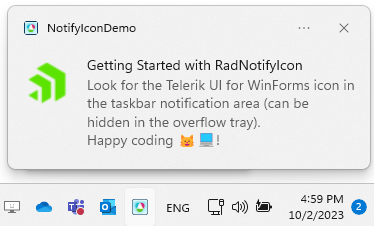
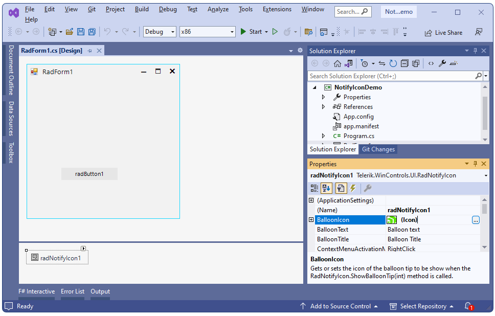
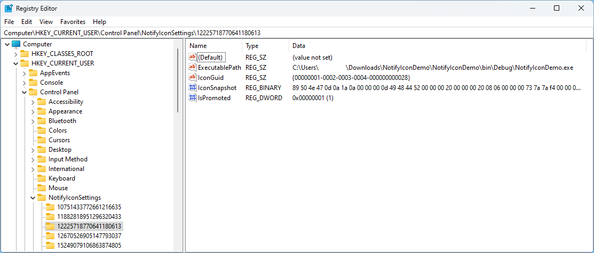
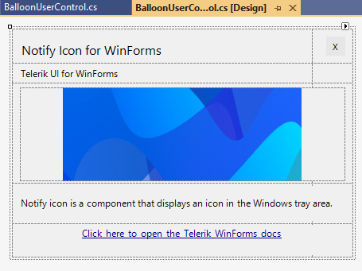
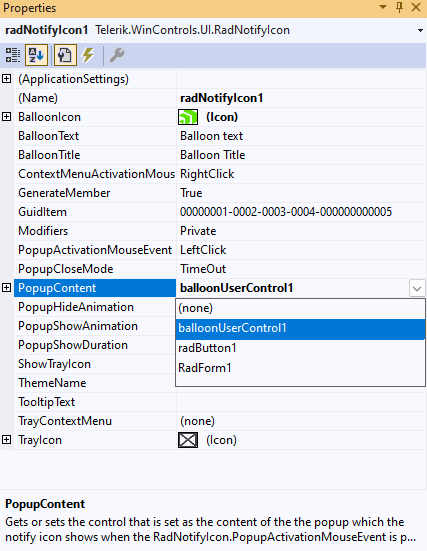
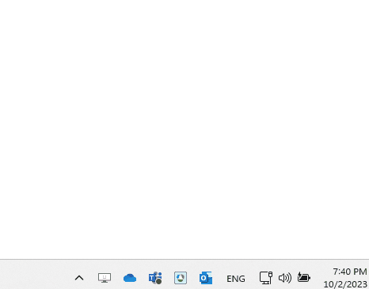

# Getting Started with WinForms NotifyIcon

 This article shows how you can start using __RadNotifyIcon__. The following result will be achieved at the end of this tutorial:

 

 Follow the steps:

1\. Go ahead and add a __RadNotifyIcon__ and a __RadButton__ from the toolbox.

2\. Set the __BalloonIcon__ property for RadNotifyIcon at design time:



3\. Add a method called __InitializeNotifyIcon__ to initialize the data displayed inside the notify balloon. The __TrayIcon__ indicates what icon will be shown in the taskbar notification area:

{{source=..\SamplesCS\NotifyIcon\Features.cs region=InitializeNotifyInfo}} 
{{source=..\SamplesVB\NotifyIcon\Features.vb region=InitializeNotifyInfo}}

````C#
         private void InitializeNotifyIcon()
        {
            this.radNotifyIcon1.ShowTrayIcon = true;
            this.radNotifyIcon1.BalloonText = "Look for the Telerik UI for WinForms icon in the taskbar notification area (can b" +
                "e hidden in the overflow tray). \r\nHappy coding 🐱‍💻!";
            this.radNotifyIcon1.TrayIcon = new System.Drawing.Icon("../../WinForms128x28.ico");
            this.radNotifyIcon1.BalloonTitle = "Getting Started with RadNotifyIcon";
            this.radNotifyIcon1.GuidItem = new System.Guid("00000001-0002-0003-0004-000000000567");

            this.radNotifyIcon1.TooltipText = "Telerik UI for WinForms RadNotifyIcon";
        }

````
````VB.NET

    Private Sub InitializeNotifyIcon()
        Me.radNotifyIcon1.ShowTrayIcon = True
        Me.radNotifyIcon1.BalloonText = "Look for the Telerik UI for WinForms icon in the taskbar notification area (can b" & "e hidden in the overflow tray). " & vbCrLf & "Happy coding 🐱‍💻!"
        Me.radNotifyIcon1.TrayIcon = New System.Drawing.Icon("../../WinForms128x28.ico")
        Me.radNotifyIcon1.BalloonTitle = "Getting Started with RadNotifyIcon"
        Me.radNotifyIcon1.GuidItem = New System.Guid("00000001-0002-0003-0004-000000000567")
        Me.radNotifyIcon1.TooltipText = "Telerik UI for WinForms RadNotifyIcon"
    End Sub
 
```` 

{{endregion}}

>caution You should replace the placeholder GuidItem with your own Guid. Make sure to create two separate Guids for building in Debug and Release mode and use the same ones for a given application. This will allow Windows to recognize the icon each time you show it in the tray.

>note Each time you use a new GuidItem, Windows will register a new icon. To learn how to clear the icon cache, you can check out the following thread: [How to remove old notification icons from the Windows 10 system tray](https://answers.microsoft.com/en-us/windows/forum/all/how-to-remove-old-notification-icons-from-the/c66892b4-51a9-44fa-853f-b17cdff5ed2f). 

>caution The __Registry Editor__ gives you access to the registered icons as well and it is possible to delete the desired icon in "Computer\HKEY_CURRENT_USER\Control Panel\NotifyIconSettings" [Read More...](https://learn.microsoft.com/en-us/windows/win32/shell/notification-area#removing-an-icon)


4\. Double click the RadButton at design time to generate its Click event handler. Then, add the code for showing the notify icon for the "NotifyIconDemo" application:

{{source=..\SamplesCS\NotifyIcon\Features.cs region=GettingStarted}} 
{{source=..\SamplesVB\NotifyIcon\Features.vb region=GettingStarted}}

````C#
         private void radButton1_Click(object sender, EventArgs e)
        {
            this.radNotifyIcon1.ShowBalloonTip();
        }

````
````VB.NET
     Private Sub radButton1_Click(ByVal sender As Object, ByVal e As EventArgs)
        Me.radNotifyIcon1.ShowBalloonTip()
    End Sub
```` 

{{endregion}}

By default, the icon will be displayed in the tray area once the application is started. If you want to manually show the icon, you can initially set its __ShowTrayIcon__ property to *False* and then set it to *True* at a later moment when it is necessary. 

## Customize the Content

RadNotifyIcon offers the __PopupContent__ property which allows you to achieve any UI that should be displayed when the tray icon is clicked. It is just necessary to add a UserControl to the form.

>caption Sample design for the BalloonUserControl



Its design depends on the exact requirement a developer may have. Then, set the __PopupContent__ property to an instance of that control.:



>note The __PopupContent__ property accepts any value of type Control.


 
## Interacting with the Icon

The RadNotifyIcon supports displaying a popup, tooltip, context menu and balloon notifications. You can learn more about each feature in its respective article:

* [Tooltip]()

* [ContextMenu]()

* [Popup]() 

* [Balloon Notifications]() 

## See Also

* [Tooltip]()
* [ContextMenu]()
* [Popup]() 
* [Balloon Notifications]() 

