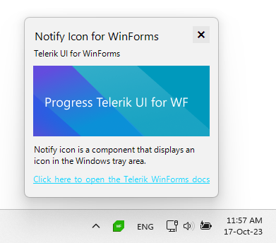

# WinForms NotifyIcon Overview

**RadNotifyIcon** is a control that can be used to display an icon in the Windows taskbar notification area. The icon can then respond to user's interaction as well as display tooltips, popups and balloon notifications.





### Key features:

Add an icon in the Windows taskbar notification area. Learn more in the [Getting Started]() article.

* **Popup**: Display a popup upon user interaction with the icon or by manually calling the exposed methods. Learn more in the [Popup]() article.

* **ContextMenu**: Show a popup to present the user with some options. Learn more in the [ContextMenu]() article.

* **Tooltip**: Display a tooltip when the icon is hovered and customize it. Check out the [Tooltip]() article for more information.

* **Balloon Notifications**: Show a notification to grab the user's attention. Check out the [Balloon Notifications]() article for more information.

* **DPI Support**: RadNotifyIcon provides support for high DPI environments.

## See Also

* [Tooltip]()

