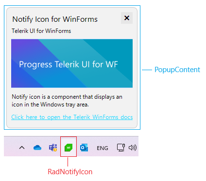
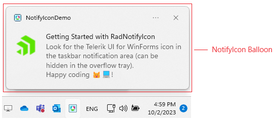
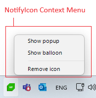
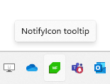

# Structure

This article describes the structure of **RadNotifyIcon**.

* **RadNotifyIcon** is a component that adds an icon to the Windows notification area inside the taskbar.

* **PopupContent** appear upon interacting with the icon and can host any Control.

## Balloon

* The balloon has a native Windows look and feel.

## Context Menu and Tooltip

* The context menu and tooltip also have a native Windows look and feel.

 
##

# See Also

* [Overview]()	
* [Design Time]()	
* [Getting Started]()	

