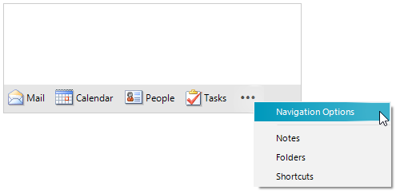
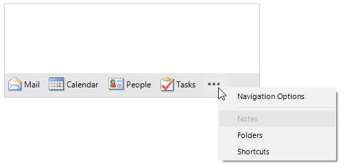

# Context Menu

The **OverflowItem** ("**...**") shows a **RadContextMenuDropDown** with the overflown items and the [NavigationOptionsMenuItem]()



>important When the user clicks the **RadOfficeNavigationBarOverflowItem** ("**...**") to open the menu, the items in  the **RadContextMenuDropDown** are always rebuilt.

**RadOfficeNavigationBar** offers the **ContextMenuDropDown** property giving direct access to the RadContextMenuDropDown with items. The ContextMenuDropDown's **DropDownOpening**, **DropDownOpened**, **DropDownClosing** and **DropDownClosed** events are suitable for handling all aspects of opening and closing the menu drop down. Once the menu is opened, the ContextMenuDropDown.**Items** collection is populated with the correct items and they can be further customized according to the specific requirements.

#### Disable Notes item in the ContextMenuDropDown.DropDownOpened event

{{source=..\SamplesCS\OfficeNavigationBar\OfficeNavigationBarGettingStarted.cs region=DisableNotes}} 
{{source=..\SamplesVB\OfficeNavigationBar\OfficeNavigationBarGettingStarted.vb region=DisableNotes}} 

````C#

private void ContextMenuDropDown_DropDownOpened(object sender, EventArgs e)
{
    foreach (RadItem item in this.radOfficeNavigationBar1.ContextMenuDropDown.Items)
    {
        if (item.Text.Contains("Notes"))
        {
            item.Enabled = false;
        }
        else
        {
            item.Enabled = true;
        }
    }
}      

````
````VB.NET

 Private Sub ContextMenuDropDown_DropDownOpened(ByVal sender As Object, ByVal e As EventArgs)
    For Each item As RadItem In Me.radOfficeNavigationBar1.ContextMenuDropDown.Items

        If item.Text.Contains("Notes") Then
            item.Enabled = False
        Else
            item.Enabled = True
        End If
    Next
End Sub

````

{{endregion}} 



# See Also

* [Structure]()	
* [Design Time]()	
* [Getting Started]()	
* [Options Dialog]()


