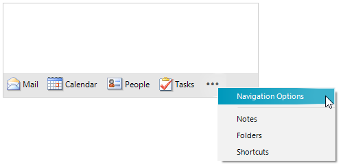
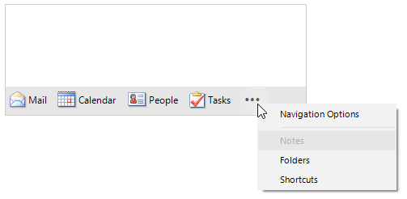

# Context Menu

The **OverflowItem** ("**...**") shows a **RadContextMenuDropDown** with the overflown items and the [NavigationOptionsMenuItem]()

>important When the user clicks the **RadOfficeNavigationBarOverflowItem** ("**...**") to open the menu, the items in  the **RadContextMenuDropDown** are always rebuilt.

**RadOfficeNavigationBar** offers the **ContextMenuDropDown** property giving direct access to the RadContextMenuDropDown with items. The ContextMenuDropDown's **DropDownOpening**, **DropDownOpened**, **DropDownClosing** and **DropDownClosed** events are suitable for handling all aspects of opening and closing the menu drop down. Once the menu is opened, the ContextMenuDropDown.**Items** collection is populated with the correct items and they can be further customized according to the specific requirements.

#### Disable Notes item in the ContextMenuDropDown.DropDownOpened Event

<snippet id='officenavigationbar-officenavigationbargettingstarted-disablenotes-cs' />
<snippet id='officenavigationbar-officenavigationbargettingstarted-disablenotes-vb' />

# See Also

* [Structure]()	
* [Design Time]()	
* [Getting Started]()	
* [Options Dialog]()

