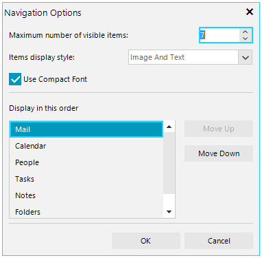

# Options Dialog

The **OfficeNavigationBarOptionsDialog** is shown when the user clicks the **NavigationOptionsMenuItem**.

>caption OfficeNavigationBarOptionsDialog



The **ShowNavigationOptionsMenuItem** property indicates whether to show the navigation options menu item when context menu is opened.

>caption NavigationOptionsMenuItem


#### Hide NavigationOptionsMenuItem

{{source=..\SamplesCS\OfficeNavigationBar\OfficeNavigationBarGettingStarted.cs region=ShowNavigationOptionsMenuItem}} 
{{source=..\SamplesVB\OfficeNavigationBar\OfficeNavigationBarGettingStarted.vb region=ShowNavigationOptionsMenuItem}} 

````C#

this.radOfficeNavigationBar1.ShowNavigationOptionsMenuItem = false;         

````
````VB.NET

Me.radOfficeNavigationBar1.ShowNavigationOptionsMenuItem = False       

````

{{endregion}} 
 
The dialog offers the following settings:

* **Maximum number of visible items**: controls the **VisibleItemsCount** property which indicates how many items to be visible on the strip. If this property is not set, it returns the count of items.
* **Items display style**: controls the **ItemsDisplayStyle** property. The available options are:
	* **None**: specifies that neither image nor text is rendered.
	* **Text**: specifies that only text is rendered.
	* **Image**: specifies that only an image is rendered.
	* **ImageAndText**: specifies that both an image and text are to be rendered.
* **Use Compact Font**: controls the **UseCompactFont** property which indicates whether to use compact or large font for the items.
* **Display in this order**: controls the items order. The `Move Up` and `Move Down` buttons reorder the items in the respective direction.

# See Also

* [Structure]()	
* [Design Time]()	
* [Getting Started]()	
* [Context Menu]()


