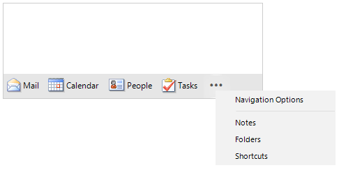

# OfficeNavigationBar

**RadOfficeNavigationBar** represents the control available in the MS Outlook 2013-2019 navigation style. 





>note The MS Outlook 2007-2010 navigation style is available in the **RadPageView** control with ViewMode set to [Outlook]().

## Key Features

* [View modes]() - *Compact* and *Full* (expanded) that control whether the items are visualized by image only or full text.
* [Options button]() - Allows the user navigate through the hidden items in the navigation bar. 
* [Navigation Options]() - The Navigation Options dialog controls the items' order, maximum number of visible items. Allows switching between full (expanded) and compact mode.
* [Peek Window]() - Shown when the user hovers an item for about 1 second.

# See Also

* [Structure]()	
* [Design Time]()	
* [Getting Started]()	

