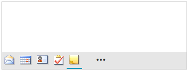
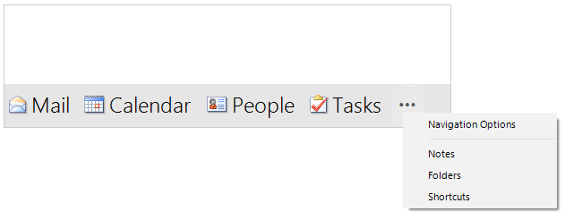

# Item Display Modes

**RadOfficeNavigationBar** offers item display modes that indicate whether the items are visualized by image only or full text. This is controlled by the **UseCompactFont** and the **ItemsDisplayStyle** properties.

## Compact

{{source=..\SamplesCS\OfficeNavigationBar\OfficeNavigationBarGettingStarted.cs region=CompactMode}} 
{{source=..\SamplesVB\OfficeNavigationBar\OfficeNavigationBarGettingStarted.vb region=CompactMode}} 

````C#

            this.radOfficeNavigationBar1.UseCompactFont = true;
            this.radOfficeNavigationBar1.ItemsDisplayStyle = DisplayStyle.Image;

````
````VB.NET

        Me.radOfficeNavigationBar1.UseCompactFont = True
        Me.radOfficeNavigationBar1.ItemsDisplayStyle = DisplayStyle.Image

````

{{endregion}} 



## Full

{{source=..\SamplesCS\OfficeNavigationBar\OfficeNavigationBarGettingStarted.cs region=FullMode}} 
{{source=..\SamplesVB\OfficeNavigationBar\OfficeNavigationBarGettingStarted.vb region=FullMode}} 

````C#

            this.radOfficeNavigationBar1.UseCompactFont = false;
            this.radOfficeNavigationBar1.ItemsDisplayStyle = DisplayStyle.ImageAndText;

````
````VB.NET

        Me.radOfficeNavigationBar1.UseCompactFont = False
        Me.radOfficeNavigationBar1.ItemsDisplayStyle = DisplayStyle.ImageAndText

````

{{endregion}} 



# See Also

* [Structure]()	
* [Design Time]()	
* [Getting Started]()	


