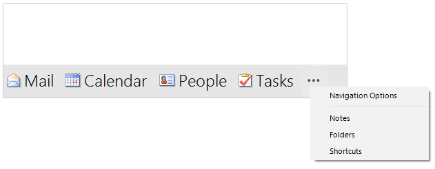

# Item Display Modes

**RadOfficeNavigationBar** offers item display modes that indicate whether the items are visualized by image only or full text. This is controlled by the **UseCompactFont** and the **ItemsDisplayStyle** properties.

## Compact

<snippet id='officenavigationbar-officenavigationbargettingstarted-compactmode-cs' />
<snippet id='officenavigationbar-officenavigationbargettingstarted-compactmode-vb' />

## Full

<snippet id='officenavigationbar-officenavigationbargettingstarted-fullmode-cs' />
<snippet id='officenavigationbar-officenavigationbargettingstarted-fullmode-vb' />

# See Also

* [Structure]()	
* [Design Time]()	
* [Getting Started]()	

