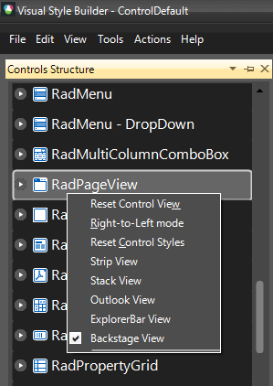
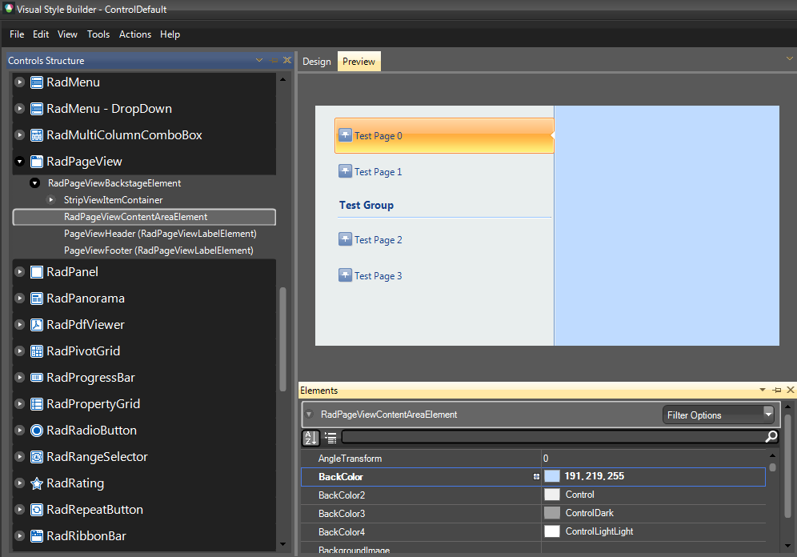
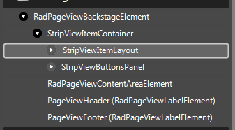
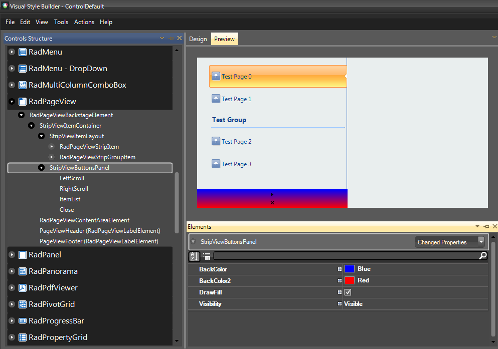
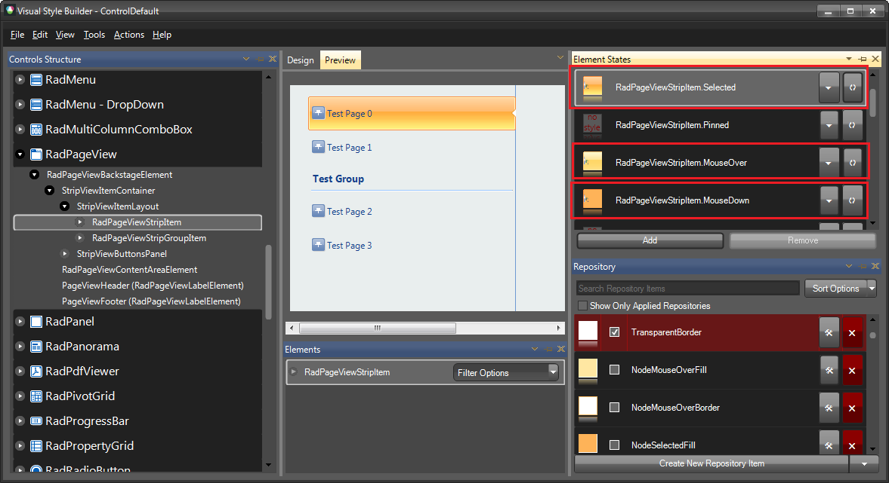
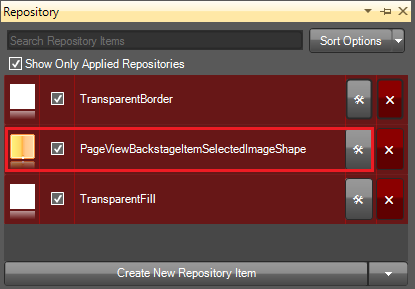
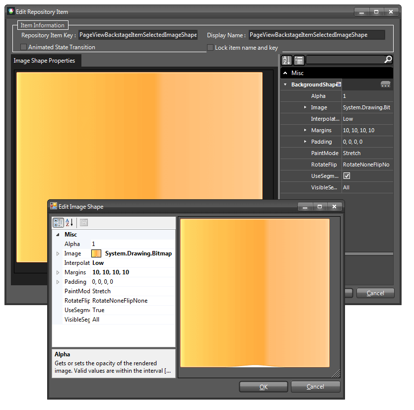
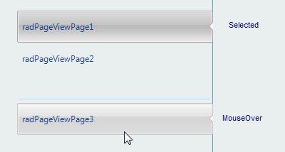
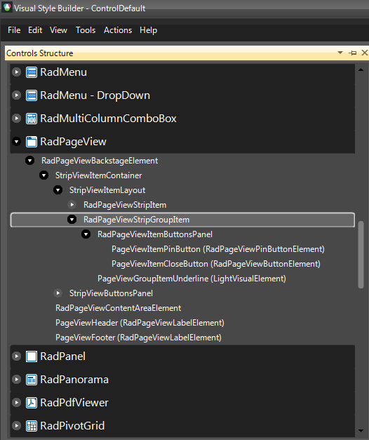

# Customizing Backstage View
 
The process of customizing the PageViewMode.*Backstage* mode of **RadPageView** includes several different stages:  

* [Customizing the content area](#customizing-the-content-area)

* [Customizing the items area](#customizing-the-items-radpageviewpages-area)

* [Customizing the ButtonsArea (if enabled)](#customizing-the-buttons-area)

* [Customizing the page items](#customizing-radpageviewitems)

* [Customizing group items](#customizing-radpageviewstripgroupitem)

All customizations are possible both through code and by creating/modifying a theme in [Visual Style Builder]() except the customization of the items (**RadPageViewPage** items or simply called tabs) since they use [ImageShape]() for their appearance.
      
>note The items in PageViewMode.*Backstage* can be styled only through [Visual Style Builder](), since they use the [ImageShape]() functionality of our Telerik Presentation Framework in order to achieve their default view.
>

## Customizing the content area

Follows an example on how to customize the content area with Visual Style Builder using the ControlDefault theme as a base. 

1\. Open the Visual Style Builder and select *File >> Export Built-in Themes…*

2\. Then click *File >> Open Package* and load the ControlDefault theme.

3\. After the theme is loaded, navigate to **RadPageView** in the Control Structure pane, right click it and select Backstage View 



4\. Expand **RadPageViewBackstageElement** and select **RadPageViewContentAreaElement**.

5\. In the Elements Window, expand the **RadPageViewBackstageElement** and set its **BackColor** property to *191, 219, 255*.



6\. Save your theme, load it to your application and set the **RadPageView** theme to be the currently created theme as explained in [Using Custom Themes]() section.

Another way of customizing the content area is in code. The following code snippet demonstrates how to access the content area:

#### Accessing the content area of Backstage View

{{source=..\SamplesCS\PageView\BackstageView.cs region=contentArea}} 
{{source=..\SamplesVB\PageView\BackstageView.vb region=contentArea}} 

````C#
RadPageViewBackstageElement backStageElement = radPageView1.ViewElement as RadPageViewBackstageElement;
backStageElement.ContentArea.BackColor = Color.Yellow;

````
````VB.NET
Dim backStageElement As RadPageViewBackstageElement = TryCast(RadPageView1.ViewElement, RadPageViewBackstageElement)
backStageElement.ContentArea.BackColor = Color.Yellow

````

{{endregion}} 

## Customizing the items (RadPageViewPages) area

The approach for customizing is the same, you just have to select the appropriate element from the Element Structure tree. In this case this is **StripViewItemLayout**.



Use the following code snippet to access the element in code:

#### Accessing the content area of Backstage View

{{source=..\SamplesCS\PageView\BackstageView.cs region=itemsArea}} 
{{source=..\SamplesVB\PageView\BackstageView.vb region=itemsArea}} 

````C#
RadPageViewBackstageElement backStageElement = radPageView1.ViewElement as RadPageViewBackstageElement;
StripViewItemLayout itemLayout = backStageElement.ItemContainer.ItemLayout as StripViewItemLayout;
itemLayout.BackColor = Color.Red;

````
````VB.NET
Dim backStageElement As RadPageViewBackstageElement = TryCast(RadPageView1.ViewElement, RadPageViewBackstageElement)
Dim itemLayout As StripViewItemLayout = TryCast(backStageElement.ItemContainer.ItemLayout, StripViewItemLayout)
itemLayout.BackColor = Color.Red

````

{{endregion}} 

## Customizing the buttons area

To access the element responsible for the buttons area, expand **RadPageViewBackstageElement** >> **StripViewItemContainer** and select **StripViewButtonsPanel**. Expanding the latter will give you the opportunity to customize the different buttons in the buttons panel.

Have in mind that the **StripViewButtonsPanel** is not visible by default. After you select it, you can make it visible by first expanding the **StripViewButtonsPanel** and then setting the **Visibility** property to *Visible*. In addition, by default it does not have a fill, so you have to set the **DrawFill** property to *true*. Now, you can customize its fill appearance.



The buttons panel can be accessed from the **ItemsContaier** of the **RadPageViewBackstageElement**:

#### Accessing the content area of Backstage View

{{source=..\SamplesCS\PageView\BackstageView.cs region=buttonsArea}} 
{{source=..\SamplesVB\PageView\BackstageView.vb region=buttonsArea}} 

````C#
RadPageViewBackstageElement backStageElement = radPageView1.ViewElement as RadPageViewBackstageElement;
StripViewButtonsPanel buttonsPanel = backStageElement.ItemContainer.ButtonsPanel as StripViewButtonsPanel;
buttonsPanel.Visibility = ElementVisibility.Visible;
buttonsPanel.DrawFill = true;
buttonsPanel.BackColor = Color.Green;

````
````VB.NET
Dim backStageElement As RadPageViewBackstageElement = TryCast(RadPageView1.ViewElement, RadPageViewBackstageElement)
Dim buttonsPanel As StripViewButtonsPanel = TryCast(backStageElement.ItemContainer.ButtonsPanel, StripViewButtonsPanel)
buttonsPanel.Visibility = ElementVisibility.Visible
buttonsPanel.DrawFill = True
buttonsPanel.BackColor = Color.Green

````

{{endregion}} 

## Customizing RadPageViewItems

As already mentioned, such a customization is only possible with [Visual Style Builder]().        

By default, page items use [ImageShape]() for their appearance. This gives you the opportunity to create an image that will have the exact size of the page item (for your application) and just apply it through the theme, or you can use the functionality that our TPF offers with the so called **ImageShape**. In our scenario we have three images to cover the *Selected*, *MouseOver* and *MouseDown* states of the page item:

|  |  |  |
| ------ | ------ | ------ |
|Down<br>|Over<br>|Selected<br>|

We will use the [ImageShape]() functionality to stretch those images in order to fill the desired items size.

1\. The element responsible for the items in Backstage View is called **RadPageViewStripItem**. Locate it in the Element Structure pane. (For the sake of this example *ControlDefault* theme is loaded in advance)


2\. Choose the desired states in this case *Selected*, *MouseOver* and *MouseDown*.



3\. Edit the corresponding **ImageShape** repository items for each state.



4\. Set the desired image and assign the desired properties in order to customize the image according to your requirement. For more information refer to the [ImageShape]() article.



5\. Save and load your new theme into the application, as described in [Using Custom Themes]() article.



## Customizing RadPageViewStripGroupItem

**RadPageViewStripGroup** item is responsible for the group items in **RadPageView** . Every group item have an underline which is also customizable (**PageViewGroupItemUnderline**).



The following code snippet demonstrates how to access and customize the group items in code:

#### Accessing the content area of Backstage View

{{source=..\SamplesCS\PageView\BackstageView.cs region=groupItems}} 
{{source=..\SamplesVB\PageView\BackstageView.vb region=groupItems}} 

````C#
RadPageViewBackstageElement backStageElement = radPageView1.ViewElement as RadPageViewBackstageElement;
StripViewItemLayout itemLayout = backStageElement.ItemContainer.ItemLayout as StripViewItemLayout;
foreach (RadPageViewStripItem item in itemLayout.Children)
{
    RadPageViewStripGroupItem groupItem = item as RadPageViewStripGroupItem;
    if (groupItem != null)
    {
        groupItem.BackColor = Color.Yellow;
        groupItem.NumberOfColors = 1;
        LightVisualElement underlineElement = ((LightVisualElement)groupItem.Children[1]);
        underlineElement.BorderBottomColor = Color.Blue;
        underlineElement.BorderTopColor = Color.Red;
    }
}

````
````VB.NET
Dim backStageElement As RadPageViewBackstageElement = TryCast(RadPageView1.ViewElement, RadPageViewBackstageElement)
Dim itemLayout As StripViewItemLayout = TryCast(backStageElement.ItemContainer.ItemLayout, StripViewItemLayout)
For Each item As RadPageViewStripItem In itemLayout.Children
    Dim groupItem = TryCast(item, RadPageViewStripGroupItem)
    If groupItem IsNot Nothing Then
        groupItem.BackColor = Color.Yellow
        groupItem.NumberOfColors = 1
        Dim underlineElement = TryCast(groupItem.Children(1), LightVisualElement)
        underlineElement.BorderBottomColor = Color.Blue
        underlineElement.BorderTopColor = Color.Red
    End If
Next

````

{{endregion}} 


# See Also

* [Load Predfined Themes]()
* [Getting Started with VisualStyleBuilder]()
* [Working With Repository Items]()
* [Using Custom Themes]()
