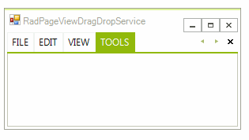

# RadPageViewDragDropService

**RadPageView** allows you to reorder the page items/tabs if the RadPageView.ViewElement.**ItemDragMode** property is set to *Preview* or *Immediate*.

>caption Figure 1: PageViewItemDragMode.Immediate

>caption Figure 2: PageViewItemDragMode.Preview

This functionality is achieved by the **RadPageViewDragDropService** which can be accessed by the RadPageView.ViewElement.**ItemDragService** property. Similar to [RadDragDropService](), **RadPageViewDragDropService** exposes public events which allows to handle the drag and drop operation and customize it according to your requirements, e.g. control which page tabs to be dragged or on what target to drop them.  

# See Also

* [RadDragDropService]()	

