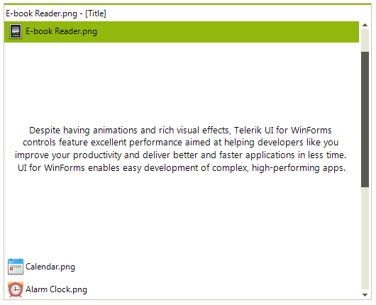

# ExplorerBarView

The PageViewMode.ExplorerBar of the **RadPageView** is designed to handle multiple visible pages at once by implementing a scrolling mechanism, as well as extended keyboard navigation. This mode introduces three types of content sizing - *FixedLenght, AutoSizeToBestFit* and *EqualLenght*, as well as two types of stack position - *Top* and *Left*.

# See Also

* [Customizing the ExplorerBarView]()	
