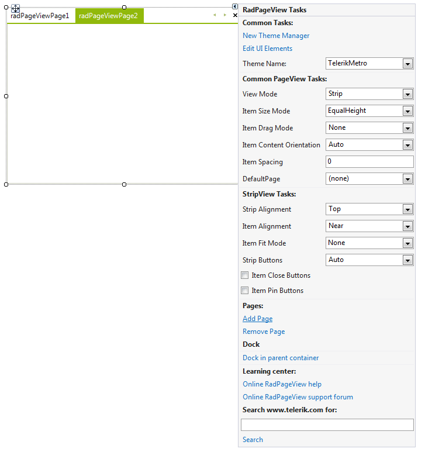

# Getting Started with WinForms PageView

This tutorial will help you to quickly get started using the control.

## Adding Telerik Assemblies Using NuGet

To use `RadPageView` when working with NuGet packages, install the `Telerik.UI.for.WinForms.AllControls` package. The [package target framework version may vary]().

Read more about NuGet installation in the [Install using NuGet Packages]() article.

>tip With the 2025 Q1 release, the Telerik UI for WinForms has a new licensing mechanism. You can learn more about it [here]().

## Adding Assembly References Manually

When dragging and dropping a control from the Visual Studio (VS) Toolbox onto the Form Designer, VS automatically adds the necessary assemblies. However, if you're adding the control programmatically, you'll need to manually reference the following assemblies:

* __Telerik.Licensing.Runtime__
* __Telerik.WinControls__
* __Telerik.WinControls.UI__
* __TelerikCommon__

The Telerik UI for WinForms assemblies can be install by using one of the available [installation approaches](). 

## Defining the RadPageView

To use **RadPageView**, you can simply drag it from Toolbox and drop it onto your form in the Visual Studio designer and use its [Smart Tag]() to add pages. To switch between the different view modes, you can set the **ViewMode** property in the *Properties* window of the control. 

>caption Figure 1: Adding pages via Smart Tag

To adjust properties of the specific view, you should find the __ViewElement__ property in the property grid and expand its sub-properties where you can find settings specific to the currently active view. This is the general approach to set up the **RadPageView** control in the designer without considering the view mode.

## See Also

* [Upgrading to RadPageView]()	
* [Design Time]()	
* [Architecture]()	

## Telerik UI for WinForms Learning Resources
* [Telerik UI for WinForms Pageview Component](https://www.telerik.com/products/winforms/pageview.aspx)
* [Getting Started with Telerik UI for WinForms Components](https://docs.telerik.com/devtools/winforms/getting-started/first-steps)
* [Telerik UI for WinForms Setup](https://docs.telerik.com/devtools/winforms/installation-and-upgrades/installing-on-your-computer)
* [Telerik UI for WinForms Application Modernization](https://docs.telerik.com/devtools/winforms/winforms-converter/overview)
* [Telerik UI for WinForms Visual Studio Templates](https://docs.telerik.com/devtools/winforms/visual-studio-integration/visual-studio-templates)
* [Deploy Telerik UI for WinForms Applications](https://docs.telerik.com/devtools/winforms/deployment-and-distribution/application-deployment)
* [Telerik UI for WinForms Virtual Classroom(Training Courses for Registered Users)](https://learn.telerik.com/learn/course/external/view/elearning/17/telerik-ui-for-winforms)
* [Telerik UI for WinForms License Agreement)](https://www.telerik.com/purchase/license-agreement/winforms-dlw-s)

