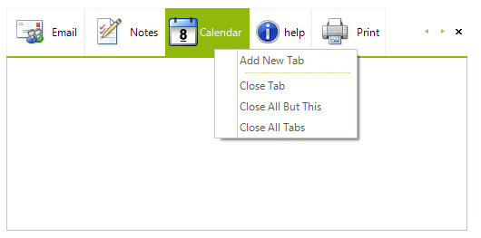

# Add ContextMenu to RadPageViewPage tabs

This help article will demonstrate you how to add custom __RadContextMenu__ to __RadPageViewPages'__ tabs, as shown in the following image.

>caption Figure 1: Context menu

To create your custom __RadContextMenu__, add its' __RadMenuItems__, set their properties and add them to the RadContextMenu.**Items** collection:

<snippet id='pageview-howto-createcontextmenu-cs' />
<snippet id='pageview-howto-createcontextmenu-vb' />

In the following code snippet you can observe, how to add the most common items functionalities:

<snippet id='pageview-howto-eventhandlerimpl-cs' />
<snippet id='pageview-howto-eventhandlerimpl-vb' />

After the context menu is created it have to be associated with __RadPageViewPages__ tabs. This can be done by subscribing to the __RadPageView__ instance' __MouseClick__ event:

<snippet id='pageview-howto-mouseclick-cs' />
<snippet id='pageview-howto-mouseclick-vb' />

# See Also

* [Assign RadContextMenu to Telerik and non-Telerik controls]()
