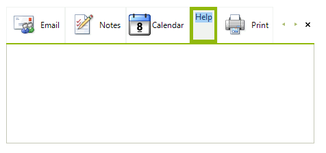
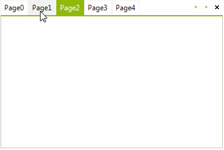
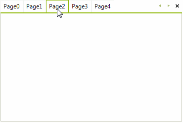

# Editing page tabs

By default, __RadPageView__ does not allow modifying of the current page tab's text. If the __AllowEdit__ property of the **ViewElement** is set to *true*, the user may select a page item and press `F2` to initiate editing. Double click also enables editing. By default, a text editor is invoked and allows the editing of the page tab's text. If the user cancels editing by pressing `Escape`, the value is not persisted. Editing can also be initiated and cancelled programmatically.

* Use the __BeginEdit()__ method to initiate editing on the selected page tab.

* Use the __EndEdit()__ method to commit any changes and ends the edit operation. 

* Use the __CancelEdit()__ method to close the currently active editor and discard the changes.

The sample code below demonstrates how to start editing:

{{source=..\SamplesCS\PageView\EditingRadPageViewElement\EditingRadPageViewElement.cs region=EnableEditing}} 
{{source=..\SamplesVB\PageView\EditingRadPageViewElement\EditingRadPageViewElement.vb region=EnableEditing}} 

````C#
radPageView1.ViewElement.AllowEdit = true;
// set the SelectedPage - this page tab will be edited  
radPageView1.SelectedPage = radPageView1.Pages[1];
// this will start edit operation on the selected page tab
radPageView1.ViewElement.BeginEdit();

````
````VB.NET
RadPageView1.ViewElement.AllowEdit = True
'set the SelectedPage - this page tab will be edited 
RadPageView1.SelectedPage = RadPageView1.Pages(1)
'this will start edit operation on the selected page tab
RadPageView1.ViewElement.BeginEdit()

````

{{endregion}} 

>caption Figure 1: Page tab's editing



## The Editing process and events

* A page that is being displayed by the __RadPageView__ is selected and the user presses the `F2` key to bring the page tab into edit mode.

* __RadPageView__ calls the __BeginEdit()__ method and a new editor instance is initialized. It is available publicly through the **ActiveEditor** property of the RadPageView.__ViewElement__ and it is associated with the page tab that is about to be edited.  

* A text box based editor appears for input.

* The editor triggers its __ValueChanging__ event when the editor’s value is being changed. This is a cancelable event, which can prevent editor’s value changing in some cases.

* The editor instance performs the action it has defined for the `Enter` key. Typically this indicates that edit mode should be exited and any changes made during the edit session should be applied to the page tab's text.

* The __ActiveEditor__ fires the __Validating__ event which allows the user to hook up custom logic for verification. If the __Validating__ event does not succeed (e.Cancel is *true*), the __ValidationError__ event is fired to notify all listeners that the validation has failed.

* __RadPageView__ sets the page label's text to the string representation of the editor's __Value__ property in case of successful validation.

The sample code below demonstrates how to forbid the user to clear the text in the page tab when pressing `Enter`:

{{source=..\SamplesCS\PageView\EditingRadPageViewElement\EditingRadPageViewElement.cs region=Edit}} 
{{source=..\SamplesVB\PageView\EditingRadPageViewElement\EditingRadPageViewElement.vb region=Edit}} 

````C#
radPageView1.ViewElement.AllowEdit = true;
radPageView1.ViewElement.EditorInitialized += ViewElement_EditorInitialized;

````
````VB.NET
RadPageView1.ViewElement.AllowEdit = True
AddHandler RadPageView1.ViewElement.EditorInitialized, AddressOf ViewElement_EditorInitialized

````

{{endregion}} 

{{source=..\SamplesCS\PageView\EditingRadPageViewElement\EditingRadPageViewElement.cs region=EditContinuation}} 
{{source=..\SamplesVB\PageView\EditingRadPageViewElement\EditingRadPageViewElement.vb region=EditContinuation}} 

````C#
        
private void ViewElement_EditorInitialized(object sender, RadPageViewEditorEventArgs e)
{
    radPageView1.ViewElement.ActiveEditor.Validating -= ActiveEditor_Validating;
    radPageView1.ViewElement.ActiveEditor.Validated -= ActiveEditor_Validated;
    radPageView1.ViewElement.ActiveEditor.ValidationError -= ActiveEditor_ValidationError;
    
    radPageView1.ViewElement.ActiveEditor.Validating += ActiveEditor_Validating;
    radPageView1.ViewElement.ActiveEditor.Validated += ActiveEditor_Validated;
    radPageView1.ViewElement.ActiveEditor.ValidationError += ActiveEditor_ValidationError;
}
        
private void ActiveEditor_Validating(object sender, CancelEventArgs e)
{
    RadPageViewElement.PageViewItemTextEditor editor =
        sender as RadPageViewElement.PageViewItemTextEditor;
    
    if (editor != null && radPageView1.ViewElement.ActiveEditor.Value == string.Empty)
    {
        e.Cancel = true;
    }
}
        
private void ActiveEditor_ValidationError(object sender, ValidationErrorEventArgs e)
{
    RadMessageBox.Show("Page label can't be empty!", "Error", MessageBoxButtons.OK, RadMessageIcon.Error);
}
        
private void ActiveEditor_Validated(object sender, EventArgs e)
{
    RadMessageBox.Show("Page label has been successfully updated!", "Information", MessageBoxButtons.OK, RadMessageIcon.Info);
}

````
````VB.NET
Private Sub ViewElement_EditorInitialized(sender As Object, e As RadPageViewEditorEventArgs)
    RemoveHandler radPageView1.ViewElement.ActiveEditor.Validating, AddressOf ActiveEditor_Validating
    RemoveHandler radPageView1.ViewElement.ActiveEditor.Validated, AddressOf ActiveEditor_Validated
    RemoveHandler radPageView1.ViewElement.ActiveEditor.ValidationError, AddressOf ActiveEditor_ValidationError
    AddHandler radPageView1.ViewElement.ActiveEditor.Validating, AddressOf ActiveEditor_Validating
    AddHandler radPageView1.ViewElement.ActiveEditor.Validated, AddressOf ActiveEditor_Validated
    AddHandler radPageView1.ViewElement.ActiveEditor.ValidationError, AddressOf ActiveEditor_ValidationError
End Sub
Private Sub ActiveEditor_Validating(sender As Object, e As CancelEventArgs)
    Dim editor As RadPageViewElement.PageViewItemTextEditor = TryCast(sender, RadPageViewElement.PageViewItemTextEditor)
    If editor IsNot Nothing AndAlso radPageView1.ViewElement.ActiveEditor.Value = String.Empty Then
        e.Cancel = True
    End If
End Sub
Private Sub ActiveEditor_ValidationError(sender As Object, e As ValidationErrorEventArgs)
    RadMessageBox.Show("Page label can't be empty!", "Error", MessageBoxButtons.OK, RadMessageIcon.[Error])
End Sub
Private Sub ActiveEditor_Validated(sender As Object, e As EventArgs)
    RadMessageBox.Show("Page label has been successfully updated!", "Information", MessageBoxButtons.OK, RadMessageIcon.Info)
End Sub

````

{{endregion}}

>caption Figure 2: Validation fails



>caption Figure 3: Successful edit operation


