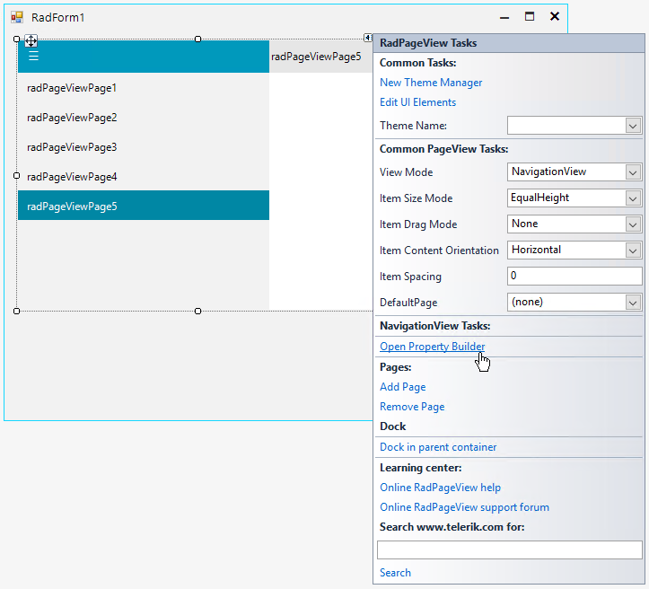

# Hierarchy Support

Navigation View offered by RadPageView allows you to define sub-items in order to achieve hierarchical menu visualizаtion.

Each **RadPageViewPage** element has a **SubPages** collection that can be populated with RadPageViewPage items, thus allowing multiple levels of items to be defined in the hierarchy.

>important The **SubPages** collection is considered only when using Navigation view. For the rest of the views, it doesn't take effect.  


### Building Hierarchy with Nested Pages Programmatically

{{source=..\SamplesCS\PageView\NavigationView.cs region=Hierarchy}} 
{{source=..\SamplesVB\PageView\NavigationView.vb region=Hierarchy}} 

````C#
RadPageViewPage inboxPage = new RadPageViewPage("Inbox");
RadPageViewPage radPageViewPage2 = new RadPageViewPage("LinkedIn");
RadPageViewPage radPageViewPage3 = new RadPageViewPage("Twitter");
RadPageViewPage radPageViewPage4 = new RadPageViewPage("Pinterest");
RadPageViewPage radPageViewPage5 = new RadPageViewPage("Subscriptions");
RadPageViewPage radPageViewPage6 = new RadPageViewPage("Order Updates");
RadPageViewPage draftsPage = new RadPageViewPage("Drafts");
RadPageViewPage sentPage = new RadPageViewPage("Sent");
RadPageViewPage importantPage = new RadPageViewPage("Important");
RadPageViewPage radPageViewPage10 = new RadPageViewPage("Univeristy");
RadPageViewPage radPageViewPage11 = new RadPageViewPage("Work");
RadPageViewPage allMailPage = new RadPageViewPage("All Mail");
RadPageViewPage spamPage = new RadPageViewPage("Spam");
RadPageViewPage deletedPage = new RadPageViewPage("Deleted");

inboxPage.SubPages.Add(radPageViewPage2);
inboxPage.SubPages.Add(radPageViewPage3);
inboxPage.SubPages.Add(radPageViewPage4);
inboxPage.SubPages.Add(radPageViewPage5);
inboxPage.SubPages.Add(radPageViewPage6);

importantPage.SubPages.Add(radPageViewPage10);
importantPage.SubPages.Add(radPageViewPage11);

this.radPageView1.Pages.Add(inboxPage);
this.radPageView1.Pages.Add(draftsPage);
this.radPageView1.Pages.Add(sentPage);
this.radPageView1.Pages.Add(importantPage);
this.radPageView1.Pages.Add(allMailPage);
this.radPageView1.Pages.Add(spamPage);
this.radPageView1.Pages.Add(deletedPage);


````
````VB.NET

Dim inboxPage As RadPageViewPage = New RadPageViewPage("Inbox")
Dim radPageViewPage2 As RadPageViewPage = New RadPageViewPage("LinkedIn")
Dim radPageViewPage3 As RadPageViewPage = New RadPageViewPage("Twitter")
Dim radPageViewPage4 As RadPageViewPage = New RadPageViewPage("Pinterest")
Dim radPageViewPage5 As RadPageViewPage = New RadPageViewPage("Subscriptions")
Dim radPageViewPage6 As RadPageViewPage = New RadPageViewPage("Order Updates")
Dim draftsPage As RadPageViewPage = New RadPageViewPage("Drafts")
Dim sentPage As RadPageViewPage = New RadPageViewPage("Sent")
Dim importantPage As RadPageViewPage = New RadPageViewPage("Important")
Dim radPageViewPage10 As RadPageViewPage = New RadPageViewPage("Univeristy")
Dim radPageViewPage11 As RadPageViewPage = New RadPageViewPage("Work")
Dim allMailPage As RadPageViewPage = New RadPageViewPage("All Mail")
Dim spamPage As RadPageViewPage = New RadPageViewPage("Spam")
Dim deletedPage As RadPageViewPage = New RadPageViewPage("Deleted")
inboxPage.SubPages.Add(radPageViewPage2)
inboxPage.SubPages.Add(radPageViewPage3)
inboxPage.SubPages.Add(radPageViewPage4)
inboxPage.SubPages.Add(radPageViewPage5)
inboxPage.SubPages.Add(radPageViewPage6)
importantPage.SubPages.Add(radPageViewPage10)
importantPage.SubPages.Add(radPageViewPage11)
Me.radPageView1.Pages.Add(inboxPage)
Me.radPageView1.Pages.Add(draftsPage)
Me.radPageView1.Pages.Add(sentPage)
Me.radPageView1.Pages.Add(importantPage)
Me.radPageView1.Pages.Add(allMailPage)
Me.radPageView1.Pages.Add(spamPage)
Me.radPageView1.Pages.Add(deletedPage)

````

{{endregion}}


### Setup Hierarchy at Design Time

At design time, the hierarchy can be built by using the Property Builder which can be started from the Smart Tag:



It allows adding new pages or dragging the existing pages to a new location and thus build nested menus:

>caption NavigationView Property Builder


