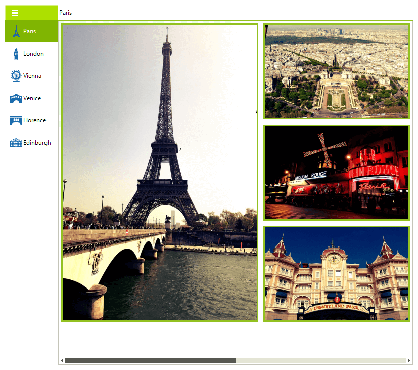

# Overview 

As of R2 2022 SP1 Telerik UI for WinForms suite offers a standalone [RadNavigationView]() control which brings your application the well-known hamburger menu experience. 
 

# See Also
* [Getting Started]()
* [Structure]()
* [RadNavigationView]()
