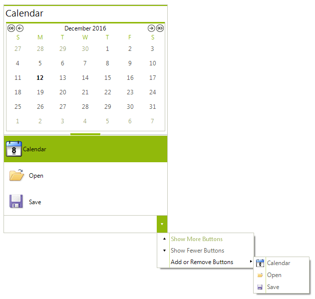

# WinForms Outlook View Overview

The PageViewMode.*Outlook* of **RadPageView** is designed to mimic the Microsoft Office 2007/2010 navigation menu by providing the ability to check/uncheck visible items and also use an overflow grip to collapse/expand the items stack. The Outlook Mode is a special case of the standard Stack Mode in terms of selection behavior and items layout. However, it does not define the stack positions supported by the Stack Mode, as well as different than Standard selection modes. The PageViewMode.**Outlook** extends the functionality of the Stack View by adding an overflow grip and overflow panel where collapsed items are displayed. There is also an overflow menu where the user can customize which items will be permanently hidden. The Outlook Mode exposes a convenient API to automate the behavior of the overflow grip, as well as the overflow menu.

>caption Figure 1: PageViewMode.Outlook

# See Also

* [Using The Overflow Grip]()	
* [Using The Overflow Menu]()	
