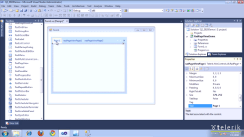

# PageView

| RELATED VIDEOS |  |
| ------ | ------ |
|[WinForms RadPageView Getting Started With RadPageView](http://tv.telerik.com/watch/winforms/getting-started-with-radpageview) In this video, you will learn what it takes to get started with RadPageView. You will also learn about its different view modes.||

**RadPageView** is yet another great addition to the Telerik UI for WinForms suite. As the name implies, this control layouts pages of sub controls in different views. 





## RadPageView layout modes

**RadPageView** supports the following modes:

## Key Features

Here are some of the key **RadPageView**'s aspects:

* Extensibility, scalability and ease of use. With the new semantic that lies behind **RadPageView**, it is very easy to create custom views over a collection of pages.

* Well thought light element tree, which reduces both memory footprint and user interaction response time and allows for easy and intuitive styling.

* Myriad of features in *Strip View* mode such as animated scrolling, items fit mode, items alignment, item size mode plus much more.

* Different View Modes to optiomize your layout: [StripView](), [OutlookView](), [ExplorerBarView](), [StackView](), [BackstageView](), [OfficeNavigationBarView](), [NavigationView]()

* Pixel-perfect look and feel.

* Polished and intuitive design-time support.

* Optional Header and Footer visual elements to emphasize on each item’s role in the application.

# See Also

* [Upgrading to RadPageView]()	
* [Design Time]()	
* [Architecture]()	

