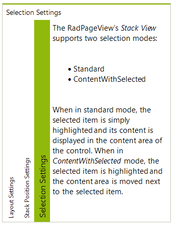
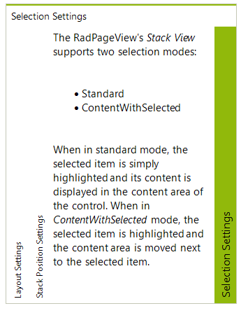
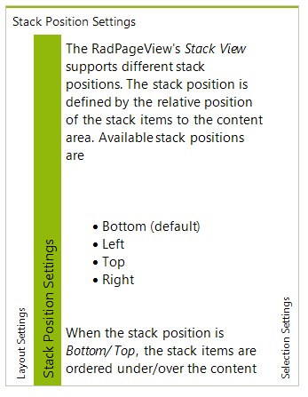

# Customizing the Selection Mode
  
The PageViewMode.*Stack* supports three types of selection modes which define how the content area is positioned according to the selected item:

* *Standard* (default): used by default and implies that the content area is positioned right next to the stack (according to the stack position as well) regardless of the currently selected item.

	

* *ContentWithSelected*: implies that the content area is positioned with the selected item (before it in the stack direction).
	
	

* *ContentAfterSelected*: The selected item is highlighted and its content is displayed after it according to the stack orientation.
	
	

To set the selection mode you should use the *ItemSelectionMode* property of the **RadPageViewStackElement** as demonstrated in the code snippet below:

#### Setting the ItemSelectionMode property

{{source=..\SamplesCS\PageView\StackView.cs region=itemSelectionMode}} 
{{source=..\SamplesVB\PageView\StackView.vb region=itemSelectionMode}} 

````C#
RadPageViewStackElement stackElement = this.radPageView1.ViewElement as RadPageViewStackElement;
stackElement.ItemSelectionMode = StackViewItemSelectionMode.ContentWithSelected;

````
````VB.NET
Dim stackElement As RadPageViewStackElement = TryCast(Me.radPageView1.ViewElement, RadPageViewStackElement)
stackElement.ItemSelectionMode = StackViewItemSelectionMode.ContentWithSelected

````

{{endregion}} 


>note The **ViewElement** property of the **RadPageView** control returns a reference to the main element of the currently active view in the control. So, to cast the **ViewElement** to any an element representing a specific view type, you should make sure that you have set the **ViewMode** of the **RadPageView** control to this view type.

# See Also

* [Customizing the Stack Position]()

