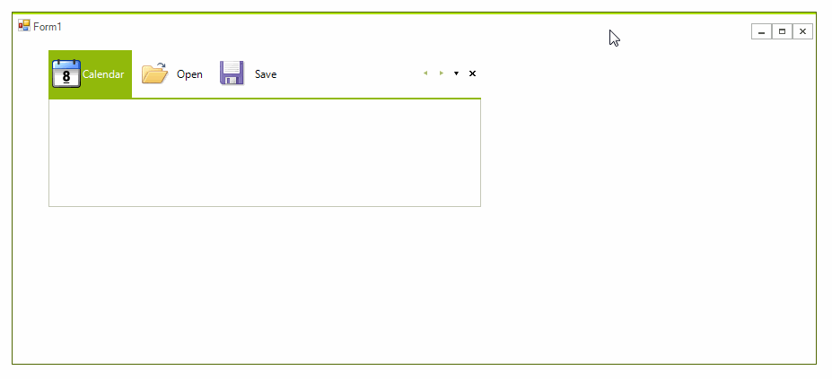
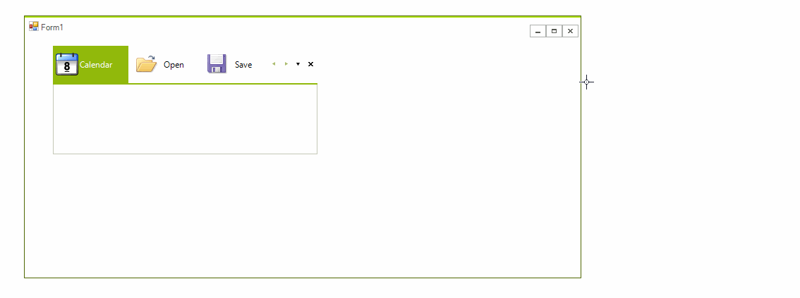
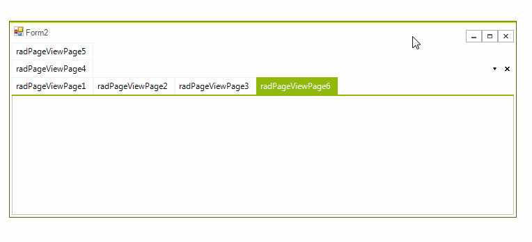
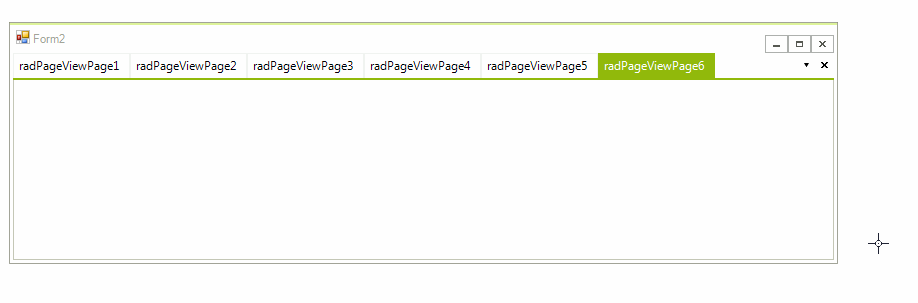

# Fitting Items
 
**RadPageView**, when its **ViewMode** property is set to *Strip*, it allows you to change the behavior of its tabs. Below you can see how.
  
The main property that controls the behavior of the tabs is the __ItemMode__ property of the __RadPageViewStripElement__.

* *None* - Each item uses its desired size.

<snippet id='pageview-stripviewfittingitems-modenone-cs' />
<snippet id='pageview-stripviewfittingitems-modenone-vb' />

* *Shrink* - Items are shrunk if their size exceeds the available one.

<snippet id='pageview-stripviewfittingitems-modeshrink-cs' />
<snippet id='pageview-stripviewfittingitems-modeshrink-vb' />

* *Fill* - Items are expanded if their size is less than the available one.

<snippet id='pageview-stripviewfittingitems-modefill-cs' />
<snippet id='pageview-stripviewfittingitems-modefill-vb' />

* *ShrinkAndFill* - Items are either shrinked or expanded when needed.

<snippet id='pageview-stripviewfittingitems-modeshrinkandfill-cs' />
<snippet id='pageview-stripviewfittingitems-modeshrinkandfill-vb' />

* *FillHeight* - Items are stretched in the available height of their parent container.

<snippet id='pageview-stripviewfittingitems-modefillheight-cs' />
<snippet id='pageview-stripviewfittingitems-modefillheight-vb' />

* *MultiLine* - Items are arranged in multiLine layout. You can also set the __MultiLineItemFitMode__ property to *None* or *Reflow*. If you set the __MultiLineItemFitMode__ property to *None* you will manually need to set the **Row** property of the items:

<snippet id='pageview-pageviewmultiline-pageviewmultilineitemfitmodenone-cs' />
<snippet id='pageview-pageviewmultiline-pageviewmultilineitemfitmodenone-vb' />

If the **MultiLineItemFitMode** property is set to *Reflow*, the layout will automatically calculate these settings:

<snippet id='pageview-pageviewmultiline-pageviewmultilineitemfitmodereflow-cs' />
<snippet id='pageview-pageviewmultiline-pageviewmultilineitemfitmodereflow-vb' />

# See Also

* [New Item]()	
* [Scrolling and Overflow (strip buttons)]()	
* [Strip Element Properties]()	
