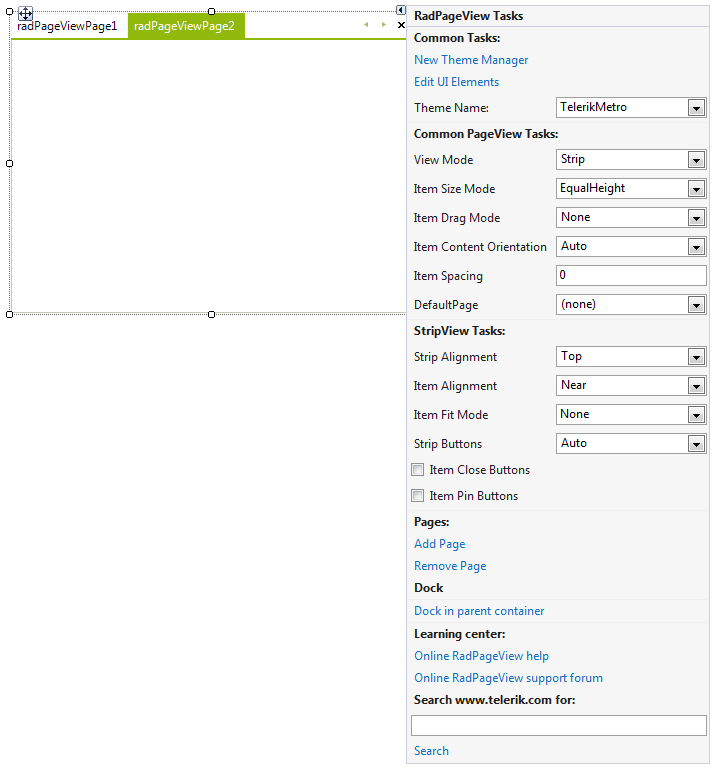
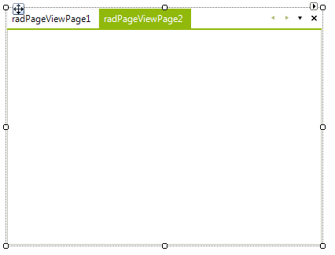
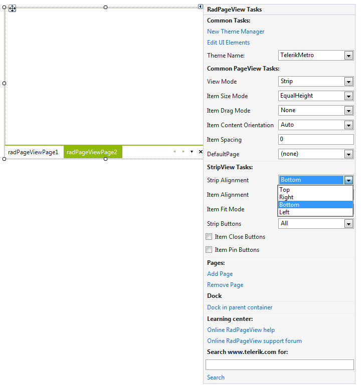
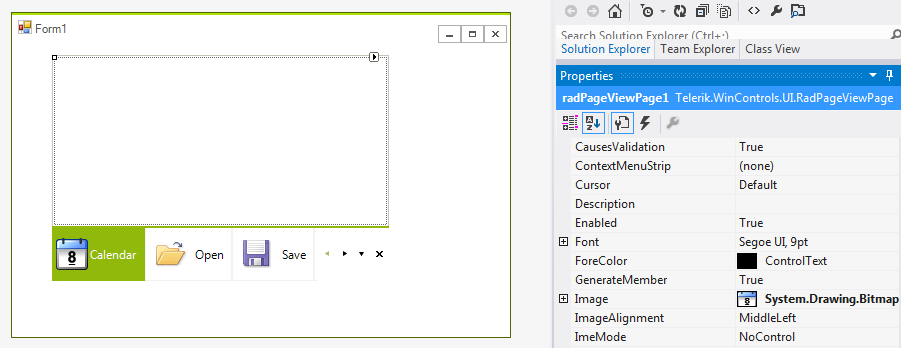
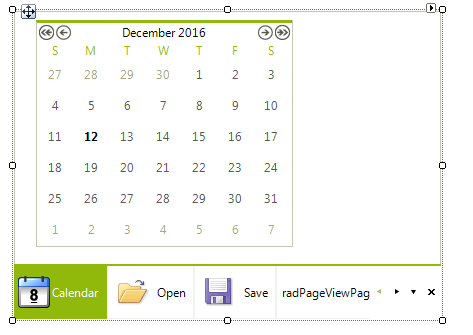

# Getting Started with WinForms Strip View

In this tutorial we are going to create a simple **RadPageView** in PageViewMode.*Strip*.

In order to achieve this, you should follow these steps:

1\. Create a new Windows Forms Application and drag **RadPageView** on your form.

2\. Click the **Smart Tag** of **RadPageView** and then click the __Add Page__ link five times. This will create five PageViewMode.*Strip*: 

3\. With the Action Menu opened, choose the *All* option from the __Strip Buttons__ drop down list. This will add an overflow button to the default scroll and close buttons. 

4\. Set the __Strip Alignment__ to *Bottom*. This will align the items to bottom in relation to the content area: 

5\. Add five images to your project as resources.

6\. From the drop down list of the Visual Studio Property Window, select each of the created **RadPageViewPages** and set its __Image__ property to an image of your choice. You can set the __Text__ in the Property Window as well: 

7\. The final step concerns the process of adding some content in the content areas of the pages. To do so, again from the drop down list of the Visual Studio Property Window, select each of the created **RadPageViewPages** and drag the appropriate controls in the content area of the currently selected page: 

# See Also

* [Scrolling and Overflow (strip buttons)]()	
* [Strip Element Properties]()	
* [New Item]()	

## Telerik UI for WinForms Learning Resources
* [Telerik UI for WinForms Stripview Component](https://www.telerik.com/products/winforms/stripview.aspx)
* [Getting Started with Telerik UI for WinForms Components](https://docs.telerik.com/devtools/winforms/getting-started/first-steps)
* [Telerik UI for WinForms Setup](https://docs.telerik.com/devtools/winforms/installation-and-upgrades/installing-on-your-computer)
* [Telerik UI for WinForms Application Modernization](https://docs.telerik.com/devtools/winforms/winforms-converter/overview)
* [Telerik UI for WinForms Visual Studio Templates](https://docs.telerik.com/devtools/winforms/visual-studio-integration/visual-studio-templates)
* [Deploy Telerik UI for WinForms Applications](https://docs.telerik.com/devtools/winforms/deployment-and-distribution/application-deployment)
* [Telerik UI for WinForms Virtual Classroom(Training Courses for Registered Users)](https://learn.telerik.com/learn/course/external/view/elearning/17/telerik-ui-for-winforms)
* [Telerik UI for WinForms License Agreement)](https://www.telerik.com/purchase/license-agreement/winforms-dlw-s)

