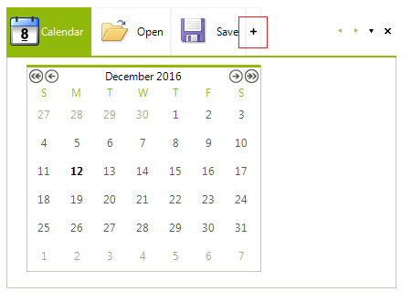
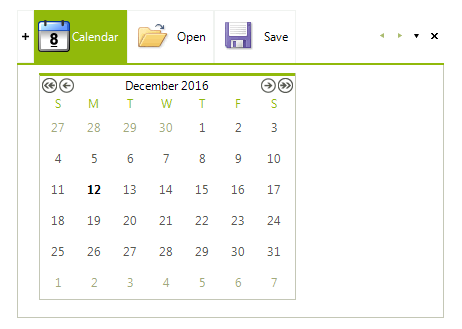
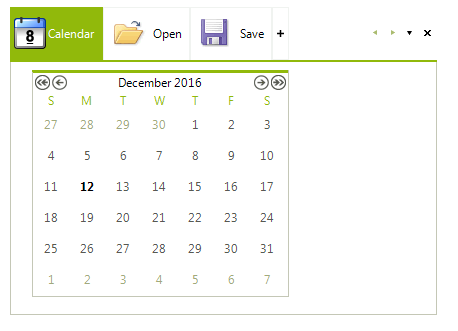
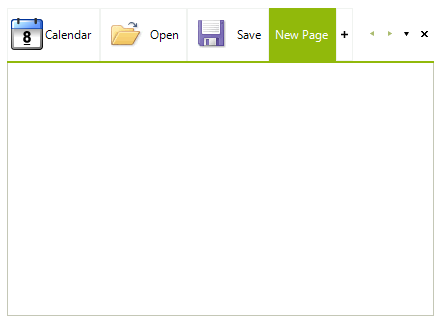

# New Item

**RadPageView** supports a special kind of page item that prompts the end-user to create a new page at run time by clicking that item. Let's call the item *NewItem*. When the *NewItem* is clicked, a special event is fired where the developer can decide what exactly should be done - in the context of **RadPageView** usually a new **RadPageViewPage** is being created.

## Enabling the NewItem

You can easily show the *NewItem* by setting the __NewItemVisibility__ property of the **RadPageViewStripElement**. This property is of the enum type **StripViewNewItemVisibility** and has the following possible values:

* __Hidden__ (default value): The *NewItem* is hidden.

* __Front__: The *NewItem* appears in front of the other page items in the items strip area.

* __End__: The *NewItem* appears at the end of the row of page items in the items strip area. 

   
        
Here is how to set the **NewItemVisibility** property:

<snippet id='pageview-newitem-settingnewitemvisibility-cs' />
<snippet id='pageview-newitem-settingnewitemvisibility-vb' />

## Handling the Clicked NewItem

When the **NewItem** is clicked by the end-user, **RadPageView** throws an event called __NewPageRequested__.  There you can create a new **RadPageViewPage** instance and add it to **RadPageView**. In the following code snippet we create a new **RadPageViewPage**, add it to **RadPageView**, select the newly created page, and make sure that the page item is fully visible by calling the **EnsureItemVisible** method.

<snippet id='pageview-newitem-newpagerequested-cs' />
<snippet id='pageview-newitem-newpagerequested-vb' />

The result is shown on the screenshot below:

# See Also

* [Fitting Items]()	
* [Scrolling and Overflow (strip buttons)]()	
* [Strip Element Properties]()	
