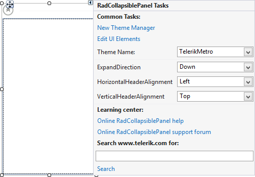

# Design Time

To start using **RadCollapsiblePanel** just drag it from the toolbox and drop it at the form.

## Smart Tag

Select **RadCollapsiblePanel** and click the small arrow on the top right position in order to open the Smart Tag.

>caption Figure 1: Smart Tag
>

* **Common Tasks**

	* **New Theme Manager**: Adds a new __RadThemeManager__ component to the form.

	* **Edit UI elements**: Opens a dialog that displays the *Element Hierarchy Editor*. This editor lets you browse all the elements in the control.
	
	* **Theme Name**: Specifies the theme set to the control.

* **RadCollapsiblePanel Actions**
	* **ExpandDirection**: Indicates the direction of the expand animation.. 

	* **HorizontalHeaderAlignment**: Determines how the elements in the header to be aligned when it is in a horizontal position.
	
	* **VerticalHeaderAlignment**: Determines how the elements in the header to be aligned when it is in a vertical position.

* **Learning Center**: Navigate to the Telerik help, code library projects or support forum.

* **Search**: Search the Telerik website for a given string.
* **Dock in Parent Container**: Sets the control **Dock** property to *Fill*.

>note Setting the **IsExpanded** property in at design time expands or collapses the control without animations.
>

# See Also

* [Structure]()
* [Getting Started]()