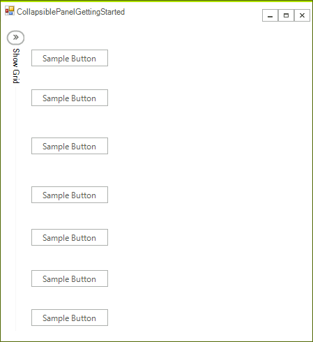
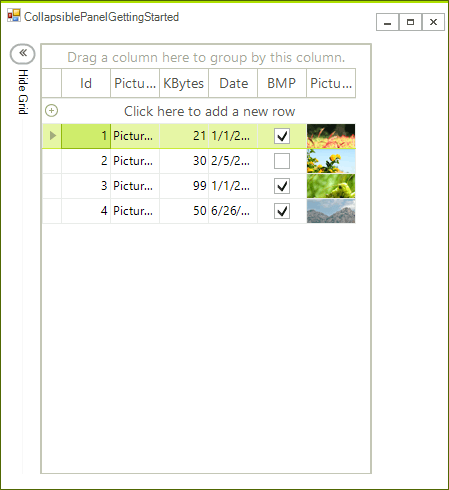
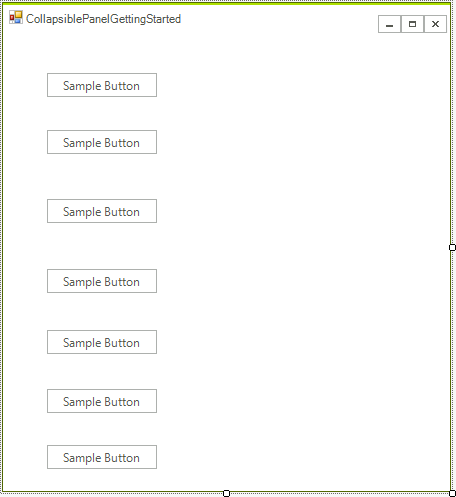
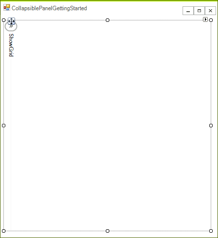

# Getting Started

__RadCollapsiblePanel__ can host many controls in its controls container area, which then can be collapsed. This way you will be able to save space in your application as the control can use as much space as it needs for its header. 

In this article you will learn the basics of how to use RadCollapsiblePanel. We will recreate a scenario where you have a [RadGridView]() which you do not want to show at all times. This is how our Form will look like when we finish if **RadCollapsiblePanel** is collapsed.

>caption Figure 1: Collapsed Panel
>


And this is how it will look if the panel is expanded.

>caption Figure 2: Expanded Panel
>


1\. Create a **RadForm** and add a few controls (buttons in our case) on the left side of the form, but leave about 30 pixels to the form’s border. These controls will be visible only when **RadCollapsiblePanel** is collapsed.



2\. Now drag a **RadCollapsiblePanel** control from the Toolbox of Visual Studio onto the form. Drag it to the top-left corner of the form and increase its height so it fits the height of the form. From the Property Window set the following properties

* __ExpandDirection__: *Right*

* __Anchor__: *Top, Left, Botton*

* __HeaderText__: *"ShowGrid"*

    

3\. Increase the panel's width to at least the half of the form. After this is ready drag a **RadGridView** to the controls container of the **RadCollapsiblePanel** instance you just created and set the following properties to the grid:

* __Dock__: *Fill*

* __DataSource__: *This is optional, you can read how to bind RadGridView* [here]()<br>

#### Handle Events

{{source=..\SamplesCS\PanelsAndLabels\CollapsiblePanel\CollapsiblePanelGettingStarted.cs region=ExpandCollapseHandlers}} 
{{source=..\SamplesVB\PanelsAndLabels\CollapsiblePanel\CollapsiblePanelGettingStarted.vb region=ExpandCollapseHandlers}} 

````C#
void radCollapsiblePanel1_Collapsed(object sender, EventArgs e)
{
    this.radCollapsiblePanel1.HeaderText = "Show Grid";
}
void radCollapsiblePanel1_Expanded(object sender, EventArgs e)
{
    this.radCollapsiblePanel1.HeaderText = "Hide Grid";
}

````
````VB.NET
Private Sub radCollapsiblePanel1_Collapsed(sender As Object, e As EventArgs)
    Me.RadCollapsiblePanel1.HeaderText = "Show Grid"
End Sub
Private Sub radCollapsiblePanel1_Expanded(sender As Object, e As EventArgs)
    Me.RadCollapsiblePanel1.HeaderText = "Hide Grid"
End Sub

````

{{endregion}} 

Our example is ready to be tested. You can start the application and observe the following:

>caption Figure 3: End Result
>


# See Also

* [Structure]()
* [Design Time]()