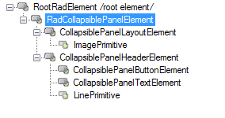
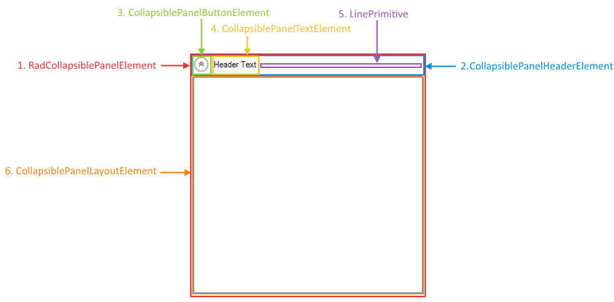

# Visual Structure

This article describes the inner structure and organization of the elements which build the **RadCollapsiblePanel** control.

>caption Figure 1: RadCollapsiblePanel`s Element Hierarchy
>

>caption Figure 2: RadCollapsiblePanel`s Structure
>

1. **RadCollapsiblePanelElement**: Main element of the **RadCollapsiblePanel** control.

1. **CollapsiblePanelHeaderElement**: element responsible for arranging the header of the control.

1. **CollapsiblePanelButtonElement**: Button element responsible for expanding and collapsing the container.

1. **CollapsiblePanelTextElement**: Text element holding the header.

1. **LinePrimitve**: Paints the line part of the header.

1. **CollapsiblePanelLayoutElement**: Layouts the container holding the added controls.

# See Also

* [Design Time]()
* [Getting Started]()