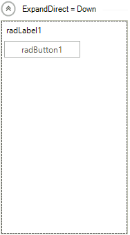
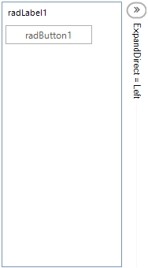
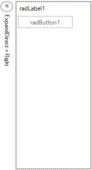
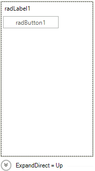
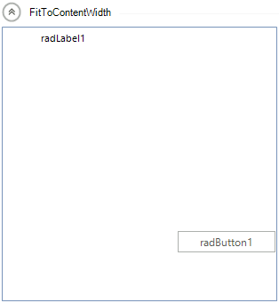
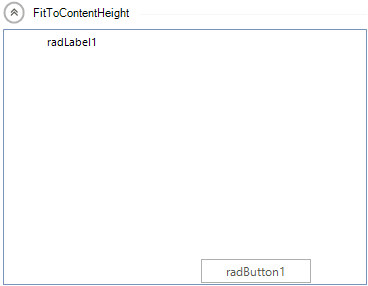
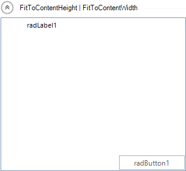

# Working with RadCollapsiblePanel

This article demonstrates how **RadCollapsiblePanel** can be manipulated via its API. 

## Important Properties

__ExpandDirection__ - Indicates the direction of the expand animation. The collapse animation is in the opposite direction.

#### RadDirection.Down

<snippet id='panels-and-labels-collapsiblepanelgettingstarted-expanddirections1-cs' />
<snippet id='panels-and-labels-collapsiblepanelgettingstarted-expanddirections1-vb' />

#### RadDirection.Left

<snippet id='panels-and-labels-collapsiblepanelgettingstarted-expanddirections2-cs' />
<snippet id='panels-and-labels-collapsiblepanelgettingstarted-expanddirections2-vb' />

#### RadDirection.Right

<snippet id='panels-and-labels-collapsiblepanelgettingstarted-expanddirections3-cs' />
<snippet id='panels-and-labels-collapsiblepanelgettingstarted-expanddirections3-vb' />

#### RadDirection.Up

<snippet id='panels-and-labels-collapsiblepanelgettingstarted-expanddirections4-cs' />
<snippet id='panels-and-labels-collapsiblepanelgettingstarted-expanddirections4-vb' />

__EnableAnimation__ - Indicates whether to use animation to expand or collapse the control.

<snippet id='panels-and-labels-collapsiblepanelgettingstarted-enableanimation-cs' />
<snippet id='panels-and-labels-collapsiblepanelgettingstarted-enableanimation-vb' />

__ContentSizingMode__ -  Indicates whether the controls container will resize to fit the width or the height of its content.

<snippet id='panels-and-labels-collapsiblepanelgettingstarted-contentsizingmode1-cs' />
<snippet id='panels-and-labels-collapsiblepanelgettingstarted-contentsizingmode1-vb' />

<snippet id='panels-and-labels-collapsiblepanelgettingstarted-contentsizingmode2-cs' />
<snippet id='panels-and-labels-collapsiblepanelgettingstarted-contentsizingmode2-vb' />

<snippet id='panels-and-labels-collapsiblepanelgettingstarted-contentsizingmode3-cs' />
<snippet id='panels-and-labels-collapsiblepanelgettingstarted-contentsizingmode3-vb' />

**ShowHeaderLine** - If *true*, a line will be displayed in the header which will fill the available space, otherwise it will not be displayed.

__HorizontalHeaderAlignment__ -Determines how the elements in the header to be aligned when it is in a horizontal position:

* Center

* Right

* Left

* Stretch

__VerticalHeaderAlignment__ - Determines how the elements in the header to be aligned when it is in a vertical position:

* Center

* Bottom

* Top

* Stretch

__AnimationType__ - Determines the type of the animation when expanding or collapsing the control:

* Reveal

* Slide

# See Also

* [Properties, Methods and Events]()
