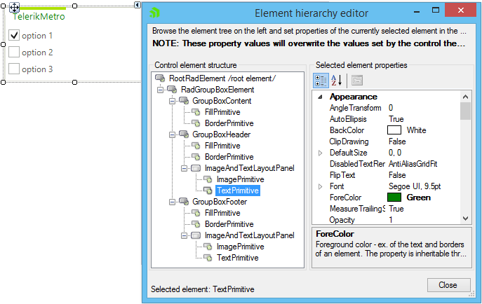
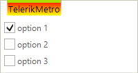

# Accessing and Customizing Elements
 
Accessing and customizing elements can be performed either at design time, or at run time. Before proceeding with this topic, it is recommended to get familiar with the [visual structure]() of the __RadGroupBox__.
      

## Design time

You can access and modify the style for different elements in __RadGroupBox__ by using the Element hierarchy editor. It can be accessed by selecting the *Edit UI Elements* item from the Smart Tag.

>caption Figure 1: Element Hierarchy Editor

## Programmatically

You can customize the nested elements at run time as well:
>caption Figure 2: Customize elements

The code sample below access the **FillPrimitive** of the header, changes the first two gradient stop colors to red and yellow, and then the gradient style to linear. *GroupBoxElement* property of the control returns the **RadGroupBoxElement**, then the code access the *GroupBoxHeader* - Children[1] - finally the code access the **FillPrimitive** - Children[0] - which is cast to **FillPrimitive** so that you can use its properties like **GradientStyle**.

#### Change the GroupBox Header Color

<snippet id='panels-and-labels-tpfstructure-changetheheadercolor-cs' />
<snippet id='panels-and-labels-tpfstructure-changetheheadercolor-vb' />

>note The code samples below are just a demonstration of how you can set node properties programmatically. You will probably prefer to use the Visual Style Builder to create your themes using no code.
>

# See Also

* [Structure]()
* [Themes]()
