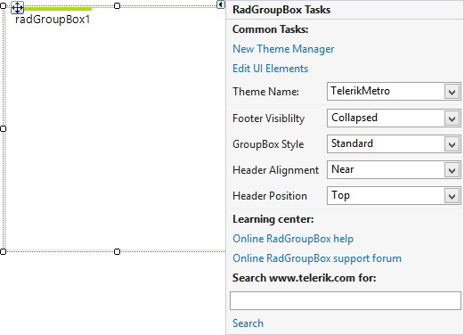

# Design Time

To start using **RadGroupBox** just drag it from the toolbox and drop it at the form.

## Smart Tag

Select **RadGroupBox** and click the small arrow on the top right position in order to open the Smart Tag.

>caption Figure 1: Smart Tag
>

* __Common Tasks__

	* __New Theme Manager__: Adds a new __RadThemeManager__ component to the form.

	* __Edit UI elements__: Opens a dialog that displays the *Element Hierarchy Editor*. This editor lets you browse all the elements in the control.

	* __Footer Visibility__: Specifies whether the footer will be present.

	* __GroupBox Style__: Sets the group box style.
	
	* __Header Alignment__: Sets the alignment of the header.
	
	* __Header Position__: Sets the position of the header.

* __Learning Center__: Navigate to the Telerik help, code library projects or support forum.

* __Search__: Search the Telerik website for a given string.

>note The [Header Styling Options]() article provides additional information about the behavior of each of the **RadGroupBox** specific properties available in the Smart Tag.

# See Also

* [Structure]()
* [Header Styling Options]()
