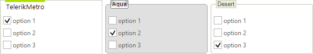
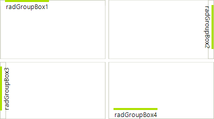
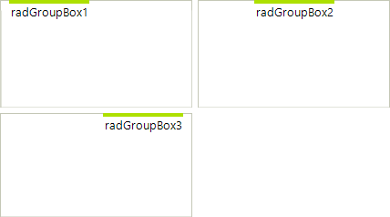
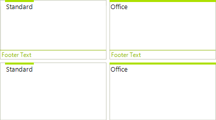

# Header Styling Options

This article describes how the header can be manipulated to change the overall appearance of the control by using the styling properties.

## Introduction To Styling

The most important RadGroupBox layout styling options include the following:

* **GroupBoxStyle**: There are two defined styles, *Standard* and *Office*. The styles are defined in **RadGroupBoxStyle** enumeration.

* **HeaderAlignment**: Header alignment options are defined in **HeaderAlignment** enumeration, *Near*, *Center*, and *Far*.

* **HeaderPosition**: Header position options are defined in **HeaderPosition** enumeration, *Top*, *Left*, *Bottom*, and *Right*.

* **HeaderMargin**: Defines the header margin.

* **FooterVisibility**: Defines the footer visibility. Its default value is *Collapsed*.

The most important **Header** and **Footer** styling options include the following ones:

* **HeaderImage**

* **FooterImage**

* **HeaderImageAlignment**

* **FooterImageAlignment**

* **HeaderText**

* **FooterText**

* **HeaderTextAlignment**

* **FooterTextAlignment**

* **HeaderTextImageRelation**

* **FooterTextImageRelation**

Please refer to [ImageAndTextLayoutPanel]() documentation section about further details of those properties.

All these properties can be set in **Visual Style Builder**. Furthermore, the control can be customized on a very fine-grained level using the *Visual Style Builder* to set any other property in the control hierarchy. Please refer to [Structure]() section for more details.

##  Header Position

The **HeaderPosition** can be set to *Top*, *Right*, *Bottom*, and *Left*: 

## Header Alignment

**HeaderAlignment** takes *Near*, *Center*, and *Far *values: 

>note **HeaderAlignment** is not taken into consideration when the **GroupBoxStyle** is set to *Office*. In this case the header occupies the whole width or height of the control. You may use **HeaderTextAlignment** and **HeaderImageAlignment** properties in this case.
>

## Group Box Style

There are two styles - *Standard *and *Office*: 

## Footer Visibility 

Footer can be *Visible, Collapsed, and Hidden:* 

Note: The default value is *Collapsed*.

## Header and Footer Images

The text and image relation can be set with the familiar properties: *HeaderImageAndTextRelation*, *HeaderImageAlignment*, and *HeaderTextAlignment*: 

There are corresponding footer properties.

# See Also

* [Structure]()
* [Accessing and Customizing Elements]()
* [Themes]()