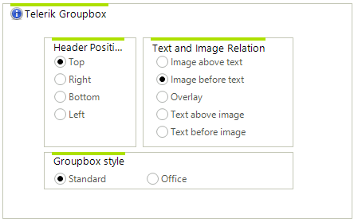

# WinForms CollapsiblePanel Overview

__RadGroupBox__ control is a group box control with advanced styling options. The primarily usage of this control is to hold a single radio buttons group.





>caption Figure 1: RadGroupBox
>

# See Also

* [Design Time]()
* [Structure]()
