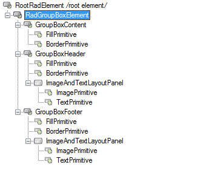
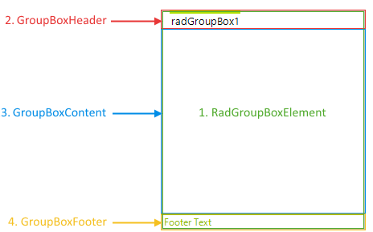

# Structure

This article describes the inner structure and organization of the elements which build the __RadGroupBox__ control.

Like all Telerik *WinForms* controls **RadGroupBox** is build upon [Telerik Presentation Framework (TPF)](). **TPF** consists of various elements (such as primitives and layouts) that are the building blocks of the controls.

>caption Figure 1: RadGroupBox`s Element Hierarchy
>

The most important nodes are **GroupBoxContent**, **GroupBoxHeader**, **GroupBoxFooter**, and **RadGroupBoxElement**. The last one also plays the role of the layout node for the control which arranges its child nodes - content, header, and footer (all three extending the **GroupBoxVisualElement** class). The footer node if not collapsed (the default value is *collapsed*) is always arranged as a bar at the bottom of the control, while the content and the header are arranged above the area occupied by the footer. All *high level* arrangement properties such as **GroupBoxStyle**, **HeaderPosition**, **HeaderAlignment**, etc. are defined as dependency properties.

>caption Figure 2: RadGroupBox`s Structure
>

1. __RadGroupBoxElement__: Represents the main element of the control responsible for arranging the layout.
1. __GroupBoxContent__: Represents the content element.
1. __GroupBoxHeader__: Represents the header.
1. __GroupBoxFooter__: Represents the footer.
        
# See Also

* [Design Time]()
* [Header Styling Options]()
