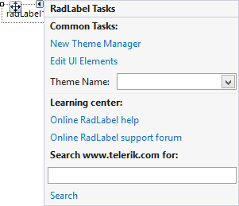

# Design Time

To start using **RadLabel** just drag it from the toolbox and drop it at the form.

## Smart Tag

Select **RadLabel** and click the small arrow on the top right position in order to open the Smart Tag.

>caption Figure 1: Smart Tag
>

* __Common Tasks__

	* __New Theme Manager__: Adds a new __RadThemeManager__ component to the form.

	* __Edit UI elements__: Opens a dialog that displays the *Element Hierarchy Editor*. This editor lets you browse all the elements in the control.
	
	* __Theme Name__: Specifies the theme set to the control.

* __Learning Center__: Navigate to the Telerik help, code library projects or support forum.

* __Search__: Search the Telerik website for a given string.

# See Also

* [Structure]()
* [Getting Started]()
* [HTML-like Formatting]()
