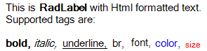

# Label

__RadLabel__ is a themeable alternative to the standard Windows Forms label control. It allows you to include a label in your applications that is consistent in look and feel with the other Telerik UI for WinForms controls. The example below uses a custom theme that provides a slight shadow to the text, and a highlight when the mouse passes over the label.





>caption Figure: 1 RadLabel

# See Also

* [Design Time]()
* [Structure]()
* [Getting Started]()
* [HTML-like Formatting]()
