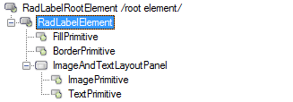

# Structure

This article describes the inner structure and organization of the elements which build the **RadLabel** control.

Like all Telerik WinForms controls **RadLabel** is build upon [Telerik Presentation Framework (TPF)](). **TPF** consists of various elements (such as primitives and layouts) that are the building blocks of the controls.

>caption Figure 1: RadLabel`s Element Hierarchy
>

* **RadLabelElement**: Represents the main element of the control.
  * **FillPrimitive**: Background color of the control
  * **BorderPrimitive**: Responsible for the control`s borders
* **ImageAndTextLayoutPanel**: Represents the content element holding the image and text.
  * **ImagePrimitive**: Element displaying an image.
  * **TextPrimitive**: Sets the properties of the text portion of the control.
        
# See Also

* [Design Time]()
* [Getting Started]()
* [HTML-like Formatting]()
