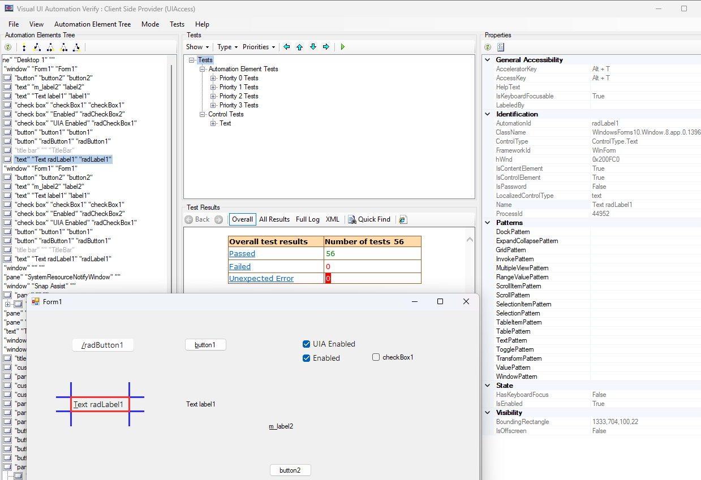

# UI Automation Support

With the __Q1 2025__ version of our controls, RadLabel supports UI Automation. The current implementation of UI Automation for RadLabel is similar to the MS WinForms Text Control Type implementation with some extended functionality. The main goal of this implementation is to ensure compliance with accessibility standards and to provide a common practice for automated testing. 

This functionality is enabled by default. To disable it, you can set the __EnableUIAutomation__ property to false.


````C#

this.radLabel1.EnableUIAutomation = false;

````
````VB.NET

Me.RadLabel1.EnableUIAutomation = False

````



## Relevant Properties 

The table below outlines the __UI Automation__ properties most important for understanding and interacting with RadLabel control.

#### RadRepeatButton 

* AutomationElementIdentifiers.AutomationIdProperty.Id 
* AutomationElementIdentifiers.AcceleratorKeyProperty.Id
* AutomationElementIdentifiers.AccessKeyProperty.Id
* AutomationElementIdentifiers.BoundingRectangleProperty.Id
* AutomationElementIdentifiers.ControlTypeProperty.Id
* AutomationElementIdentifiers.LabeledByProperty.Id
* AutomationElementIdentifiers.IsEnabledProperty.Id
* AutomationElementIdentifiers.LocalizedControlTypeProperty.Id => "text"
* AutomationElementIdentifiers.HelpTextProperty.Id
* AutomationElementIdentifiers.IsContentElementProperty.Id
* AutomationElementIdentifiers.IsControlElementProperty.Id
* AutomationElementIdentifiers.IsKeyboardFocusableProperty.Id
* AutomationElementIdentifiers.NameProperty.Id 

## Supported Control Patterns

The __RadLabelUIAutomationProvider__ class does not expose any supported patterns.

The RadLabel control raises the following events

* __OnTextChanged__: Raises the:
	* [UIA TextPatternIdentifiers.TextChangedEvent Field](https://learn.microsoft.com/en-us/dotnet/api/system.windows.automation.textpatternidentifiers.textchangedevent?view=windowsdesktop-9.0#system-windows-automation-textpatternidentifiers-textchangedevent)
	* [UIA AutomationElementIdentifiers.NameProperty Field](https://learn.microsoft.com/en-us/dotnet/api/system.windows.automation.automationelementidentifiers.nameproperty?view=windowsdesktop-9.0#system-windows-automation-automationelementidentifiers-nameproperty)
	
* __OnEnabledChanged__: Raises the [UIA AutomationElementIdentifiers.IsEnabledProperty Field](https://learn.microsoft.com/en-us/dotnet/api/system.windows.automation.automationelementidentifiers.isenabledproperty?view=windowsdesktop-9.0#system-windows-automation-automationelementidentifiers-isenabledproperty)

