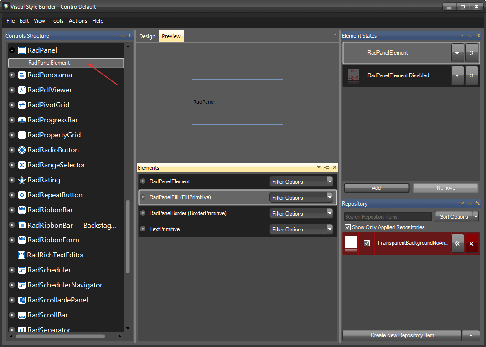
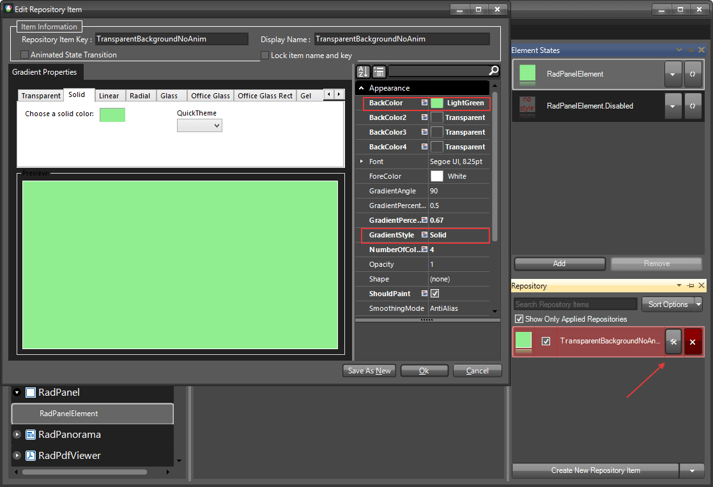

# Themes

This help article will demonstrate a step by step tutorial how to customize the **ControlDefault** theme for **RadPanel**.

1. Open [VisualStyleBuilder]().

1. [Export the built-in themes] (). in a specific folder by selecting *File >> Export Built-in Themes*.

1. Load a desired theme from the just exported files by selecting *File >> Open Package*

1. Navigate to **RadPanel** in `Controls Structure` on the left side. 
    

1. Modify the applied background repository item.
    

1. Save the theme by selecting *File >> Save As*.

1. Now, you can apply your custom theme to **RadPanel** by using the approach demonstrated in the following link: [Using custom themes]()

# See Also

* [Structure]()
* [Creating a RadPanel with Gradient Background]()
* [Creating a RadPanel with Rounded Corners]()
 
