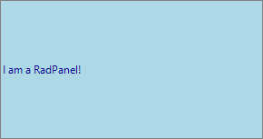

# Getting Started

You can add a **RadPanel** either at design time or at run-time:

## Design Time

1. To add a **RadPanel** to your form, drag a **RadPanel** from the toolbox onto the surface of the form designer.
2. In the *Properties* section in Visual Studio change the **Dock** property of **RadPanel** to *Fill*.
3. Drag another control from the toolbox and place it on the panel.
4. Click `F5` to start the application.

## Run Time

To programmatically add a **RadPanel** to a form, create a new instance of a **RadPanel**, and add it to the form`s __Controls__ collection. Change its **Text**, **ForeColor**, and **BackColor** properties.

>caption Figure 1: RadPanel Run-time


#### Adding a RadPanel at Run-time 

{{source=..\SamplesCS\PanelsAndLabels\Panel\PanelGettingStarted.cs region=AddPanel}} 
{{source=..\SamplesVB\PanelsAndLabels\Panel\PanelGettingStarted.vb region=AddPanel}}
````C#
RadPanel panel = new RadPanel();
this.Controls.Add(panel);
panel.ForeColor = Color.DarkBlue;
panel.BackColor = Color.LightBlue;
panel.PanelElement.PanelBorder.ForeColor = Color.Gray;
panel.Text = "I am a RadPanel!";

````
````VB.NET
Dim panel As New RadPanel()
Me.Controls.Add(panel)
panel.ForeColor = Color.DarkBlue
panel.BackColor = Color.LightBlue
panel.PanelElement.PanelBorder.ForeColor = Color.Gray
panel.Text = "I am a RadPanel!"

````


{{endregion}}

## Programming RadPanel

**RadPanel** shares most of the properties of the standard Windows Form Panel, including:

* The __BackColor__ property sets the background color of the control.

* The __BackgroundImage__ and __BackgroundImageLayout__ properties allow you to tile, center, stretch, or zoom an image across the control.

* The __ForeColor__ property sets the control`s text color.

* The __Text__ property sets the text in the control.

The example below has the **BackgroundImage** property set to the Progress logo.

>caption Figure 2: RadPanel BackgroundImage


# See Also

* [Design Time]()
* [Structure]()
