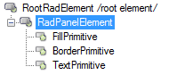
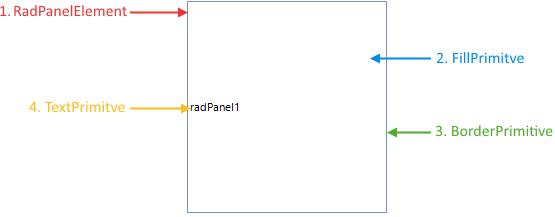

# Structure

This article describes the inner structure and organization of the elements which build the **RadPanel** control.

Like all Telerik WinForms controls **RadPanel** is build upon [Telerik Presentation Framework (TPF)](). **TPF** consists of various elements (such as primitives and layouts) that are the building blocks of the controls.

>caption Figure 1: RadPanel`s Element Hierarchy
>

>caption Figure 2: RadPanel`s Structure
>

* **RadPanelElement**: Represents the main element of the control.
  * **FillPrimitive**: Background color of the control
  * **BorderPrimitive**: Responsible for the control`s borders
  * **TextPrimitive**: Sets the properties of the text portion of the control.
        
# See Also

* [Design Time]()
* [Getting Started]()