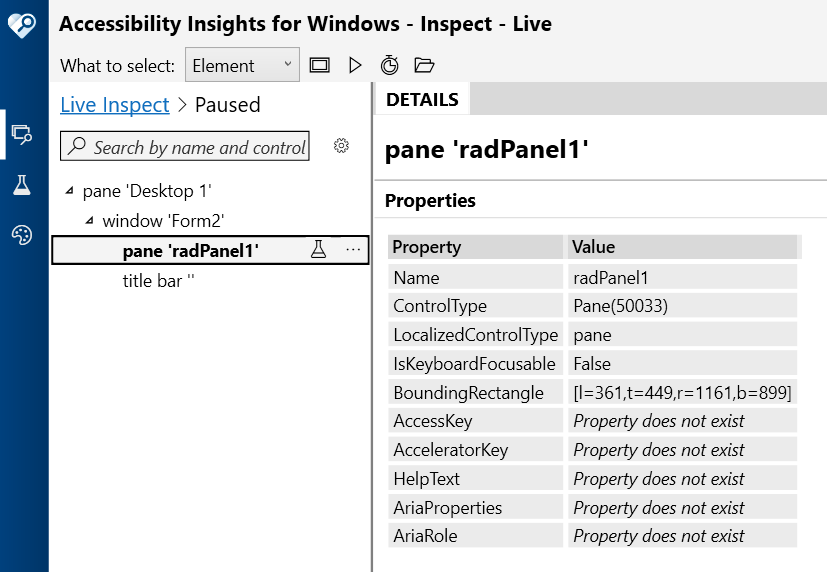

# UI Automation Support

With the __Q1 2026 Minor__ version of our controls, RadPanel supports UI Automation. The current implementation of UI Automation for RadPanel is similar to the MS WinForms Pane implementation with some extended functionality. The main goal of this implementation is to ensure compliance with accessibility standards and to provide a common practice for automated testing. 

| **UIA Tree Structure**|
|------------------------|
| ├─ [Pane](https://learn.microsoft.com/en-us/dotnet/framework/ui-automation/ui-automation-support-for-the-pane-control-type) |
| &nbsp;&nbsp;&nbsp;&nbsp;└─ [child WinForms controls — via host provider, not this provider] |

This functionality is enabled by default. To disable it, you can set the __EnableUIAutomation__ property to false.

````C#

this.radPanel1.EnableUIAutomation = false;

````
````VB.NET

Me.RadPanel1.EnableUIAutomation = False

````



## Relevant Properties 

The table below outlines the __UI Automation__ properties most important for understanding and interacting with RadPanel control.

#### RadPanelUIAutomationProvider 

* AutomationElementIdentifiers.ControlTypeProperty.Id => ControlType.Pane.Id
* AutomationElementIdentifiers.LocalizedControlTypeProperty.Id => "pane"
* AutomationElementIdentifiers.IsContentElementProperty.Id => true
* AutomationElementIdentifiers.IsControlElementProperty.Id => true
* AutomationElementIdentifiers.IsKeyboardFocusableProperty.Id => false
* AutomationElementIdentifiers.NameProperty.Id 
* AutomationElementIdentifiers.ClickablePointProperty.Id

## Supported Control Patterns

`RadPanel` does not implement any control patterns directly. Per the UIA Pane control type specification, the following patterns are classified as **Never** supported:

* WindowPattern
* WindowOpenedEvent / WindowClosedEvent
* WindowVisualStateProperty

## Navigation

`RadPanel` does not expose custom UIA children through navigation. Child element discovery is handled by the UIA framework via the standard `HostRawElementProvider` mechanism (the Win32 HWND hierarchy).

`ElementProviderFromPoint` always returns `this` — child hit testing is deferred to the UIA framework.
