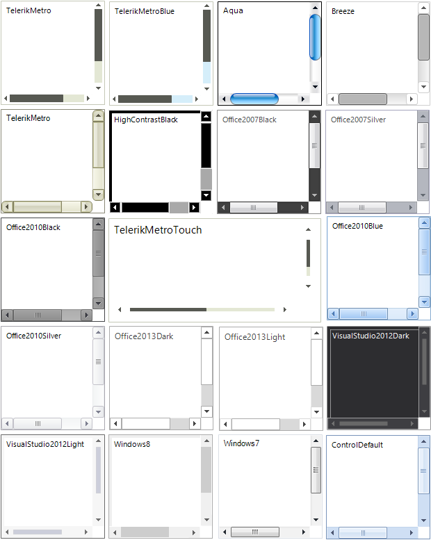

# RadScrollablePanel

**RadScrollablePanel** is a variation of [RadPanel](), but customized to support themable scrollbars. The control is composed of two [RadScrollBars](). and a RadPanel that represents a container for other controls and provides the scrolling functionality. The control can be used exactly as a standard panel - any controls can be easily added to it with the standard Visual Studio drag-and-drop routine. It supports all Telerik Themes, but the appearance of the panel and the scrollbars can be further customized to fit your application skin theme.





>caption Figure 1: RadScrollablePanel
>

# See Also

* [Panel]()
* [Collapsible Panel]()