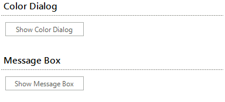
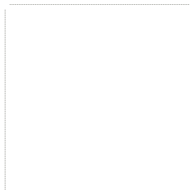

# WinForms Separator Overview

**RadSeparator** is a control that gives you the ability to divide your forms into logical parts. By default it contains of two lines.





>caption Figure 1: RadSeparator

The control have several properties that you might find interesting:

* __Orientation__ - gets or sets the control orientation to Vertical or Horizontal

    

* __ShadowOffset__ - gets or sets the offset of the both lines, both horizontal and vertical

* __ShowShadow__ - enables/disables the second line

* __SeparatorElement__ - the element that holds the lines. Gives you the ability to access and customize them

Follows a small sample, which demonstrates how to take advantage of the functionalities of RadSeparator

#### Customize RadSeparator

<snippet id='panels-and-labels-separator-separatorexample-cs' />
<snippet id='panels-and-labels-separator-separatorexample-vb' />

Here is the result of the following code:

>caption Figure 2: RadSeparator Customization

## Telerik UI for WinForms Learning Resources
* [Telerik UI for WinForms Separator Homepage](https://www.telerik.com/products/winforms/separator.aspx)
* [Telerik UI for WinForms API Reference](https://docs.telerik.com/devtools/winforms/api/)
* [Getting Started with Telerik UI for WinForms Components]()
* [Telerik UI for WinForms Virtual Classroom (Training Courses for Registered Users)](https://learn.telerik.com/learn/course/external/view/elearning/17/TelerikUIforWinForms) 
* [Telerik UI for WinForms Forum](https://www.telerik.com/forums/winforms)
* [Telerik UI for WinForms Knowledge Base](https://docs.telerik.com/devtools/winforms/knowledge-base)

## See Also

* [Panel]()
* [Collapsible Panel]()
* [Scrollable Panel]()
