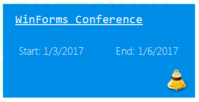

# Custom Tiles

This article demonstrates how you can create custom tiles. The bellow sample code adds four elements to the tile. The result is shown in following screenshot.

>caption Figure 1: Custom Title.



The code snippet bellow illustrates how the layout is achieved. There is a [GridLayout]() which is taking care of the items arrangement. Four [LightVisualElements]() are added to the grid layout. The first is used for the subject, the second and third for the start/end dates and the forth is used for the icon. The back color is changed in the class constructor.

#### Custom Tile Class

{{source=..\SamplesCS\Panorama\CustomTiles.cs region=CustomTileClass}} 
{{source=..\SamplesVB\Panorama\CustomTiles.vb region=CustomTileClass}} 

````C#
class CustomTileElement : RadTileElement
{
    LightVisualElement subject;
    LightVisualElement startTime;
    LightVisualElement endTime;
    LightVisualElement alarmIcon;
    GridLayout layoutPanel;
    protected override void CreateChildElements()
    {
        base.CreateChildElements();
        layoutPanel = new GridLayout();
        layoutPanel.Columns.Clear();
        layoutPanel.Rows.Clear();
        layoutPanel.StretchHorizontally = false;
        layoutPanel.StretchVertically = false;
        //add columns
        layoutPanel.Columns.Add(new GridLayoutColumn()
        {
            SizingType = GridLayoutSizingType.Proportional,
            ProportionalWidthWeight = 50
        });
        layoutPanel.Columns.Add(new GridLayoutColumn()
        {
            SizingType = GridLayoutSizingType.Proportional,
            ProportionalWidthWeight = 50
        });
        //add rows
        layoutPanel.Rows.Add(new GridLayoutRow()
        {
            SizingType = GridLayoutSizingType.Proportional,
            ProportionalHeightWeight = 33
        });
        layoutPanel.Rows.Add(new GridLayoutRow()
        {
            SizingType = GridLayoutSizingType.Proportional,
            ProportionalHeightWeight = 33
        });
        layoutPanel.Rows.Add(new GridLayoutRow()
        {
            SizingType = GridLayoutSizingType.Proportional,
            ProportionalHeightWeight = 34
        });
        subject = new LightVisualElement();
        subject.Text = "WinForms Conference";
        subject.Font = new System.Drawing.Font("Consolas", 18, FontStyle.Underline);
        subject.BackColor = Color.Aqua;
        subject.TextAlignment = ContentAlignment.MiddleLeft;
        subject.Padding = new System.Windows.Forms.Padding(20, 0, 0, 0);
        subject.SetValue(GridLayout.RowIndexProperty, 0);
        subject.SetValue(GridLayout.ColumnIndexProperty, 0);
        subject.SetValue(GridLayout.ColSpanProperty, 2);
        startTime = new LightVisualElement();
        startTime.Text = "Start: " + DateTime.Now.ToShortDateString();
        startTime.SetValue(GridLayout.RowIndexProperty, 1);
        startTime.SetValue(GridLayout.ColumnIndexProperty, 0);
        endTime = new LightVisualElement();
        endTime.Text = "End: " + DateTime.Now.AddDays(3).ToShortDateString();
        endTime.SetValue(GridLayout.RowIndexProperty, 1);
        endTime.SetValue(GridLayout.ColumnIndexProperty, 1);
        alarmIcon = new LightVisualElement();
        alarmIcon.Image = Image.FromFile(@"../../bell.png").GetThumbnailImage(35, 35, null, IntPtr.Zero);
        alarmIcon.ImageLayout = System.Windows.Forms.ImageLayout.None;
        alarmIcon.Padding = new System.Windows.Forms.Padding(0, 0, 10, 0);
        alarmIcon.ImageAlignment = ContentAlignment.MiddleRight;
        alarmIcon.SetValue(GridLayout.RowIndexProperty, 2);
        alarmIcon.SetValue(GridLayout.ColumnIndexProperty, 1);
        this.layoutPanel.Children.Add(subject);
        this.layoutPanel.Children.Add(startTime);
        this.layoutPanel.Children.Add(endTime);
        this.layoutPanel.Children.Add(alarmIcon);
        this.Children.Add(layoutPanel);
    }
    public CustomTileElement()
    {
        this.BackColor = ColorTranslator.FromHtml("#008de7");
    }
    protected override Type ThemeEffectiveType
    {
        get
        {
            return typeof(RadTileElement);
        }
    }
}

````
````VB.NET
Friend Class CustomTileElement
    Inherits RadTileElement
    Private subject As LightVisualElement
    Private startTime As LightVisualElement
    Private endTime As LightVisualElement
    Private alarmIcon As LightVisualElement
    Private layoutPanel As GridLayout
    Protected Overrides Sub CreateChildElements()
        MyBase.CreateChildElements()
        layoutPanel = New GridLayout()
        layoutPanel.Columns.Clear()
        layoutPanel.Rows.Clear()
        layoutPanel.StretchHorizontally = False
        layoutPanel.StretchVertically = False
        'add columns
        layoutPanel.Columns.Add(New GridLayoutColumn() With {.SizingType = GridLayoutSizingType.Proportional, .ProportionalWidthWeight = 50})
        layoutPanel.Columns.Add(New GridLayoutColumn() With {.SizingType = GridLayoutSizingType.Proportional, .ProportionalWidthWeight = 50})
        'add rows
        layoutPanel.Rows.Add(New GridLayoutRow() With {.SizingType = GridLayoutSizingType.Proportional, .ProportionalHeightWeight = 33})
        layoutPanel.Rows.Add(New GridLayoutRow() With {.SizingType = GridLayoutSizingType.Proportional, .ProportionalHeightWeight = 33})
        layoutPanel.Rows.Add(New GridLayoutRow() With {.SizingType = GridLayoutSizingType.Proportional, .ProportionalHeightWeight = 34})
        subject = New LightVisualElement()
        subject.Text = "WinForms Conference"
        subject.Font = New System.Drawing.Font("Consolas", 18, FontStyle.Underline)
        subject.BackColor = Color.Aqua
        subject.TextAlignment = ContentAlignment.MiddleLeft
        subject.Padding = New System.Windows.Forms.Padding(20, 0, 0, 0)
        subject.SetValue(GridLayout.RowIndexProperty, 0)
        subject.SetValue(GridLayout.ColumnIndexProperty, 0)
        subject.SetValue(GridLayout.ColSpanProperty, 2)
        startTime = New LightVisualElement()
        startTime.Text = "Start: " & Date.Now.ToShortDateString()
        startTime.SetValue(GridLayout.RowIndexProperty, 1)
        startTime.SetValue(GridLayout.ColumnIndexProperty, 0)
        endTime = New LightVisualElement()
        endTime.Text = "End: " & Date.Now.AddDays(3).ToShortDateString()
        endTime.SetValue(GridLayout.RowIndexProperty, 1)
        endTime.SetValue(GridLayout.ColumnIndexProperty, 1)
        alarmIcon = New LightVisualElement()
        alarmIcon.Image = Image.FromFile("../../bell.png").GetThumbnailImage(35, 35, Nothing, IntPtr.Zero)
        alarmIcon.ImageLayout = System.Windows.Forms.ImageLayout.None
        alarmIcon.Padding = New System.Windows.Forms.Padding(0, 0, 10, 0)
        alarmIcon.ImageAlignment = ContentAlignment.MiddleRight
        alarmIcon.SetValue(GridLayout.RowIndexProperty, 2)
        alarmIcon.SetValue(GridLayout.ColumnIndexProperty, 1)
        Me.layoutPanel.Children.Add(subject)
        Me.layoutPanel.Children.Add(startTime)
        Me.layoutPanel.Children.Add(endTime)
        Me.layoutPanel.Children.Add(alarmIcon)
        Me.Children.Add(layoutPanel)
    End Sub
    Public Sub New()
        Me.BackColor = ColorTranslator.FromHtml("#008de7")
    End Sub
    Protected Overrides ReadOnly Property ThemeEffectiveType() As Type
        Get
            Return GetType(RadTileElement)
        End Get
    End Property
End Class

````

{{endregion}}

You can use the new tile with the following code:

#### Add the new tile to RadPanorama

{{source=..\SamplesCS\Panorama\CustomTiles.cs region=AddTile}} 
{{source=..\SamplesVB\Panorama\CustomTiles.vb region=AddTile}} 

````C#
CustomTileElement tile = new CustomTileElement();
tile.RowSpan = 2;
tile.ColSpan = 4;
radPanorama1.Items.Add(tile);

````
````VB.NET
Dim tile As New CustomTileElement()
tile.RowSpan = 2
tile.ColSpan = 4
RadPanorama1.Items.Add(tile)

````

{{endregion}}

# See Also

* [Properties and Methods ]()	
* [Tiles]()	
