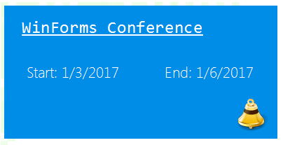

# Custom Tiles

This article demonstrates how you can create custom tiles. The bellow sample code adds four elements to the tile. The result is shown in following screenshot.

>caption Figure 1: Custom Title

The code snippet bellow illustrates how the layout is achieved. There is a [GridLayout]() which is taking care of the items arrangement. Four [LightVisualElements]() are added to the grid layout. The first is used for the subject, the second and third for the start/end dates and the forth is used for the icon. The back color is changed in the class constructor.

#### Custom Tile Class

<snippet id='panorama-customtiles-customtileclass-cs' />
<snippet id='panorama-customtiles-customtileclass-vb' />

You can use the new tile with the following code:

#### Add the new tile to RadPanorama

<snippet id='panorama-customtiles-addtile-cs' />
<snippet id='panorama-customtiles-addtile-vb' />

# See Also

* [Properties and Methods ]()	
* [Tiles]()	
