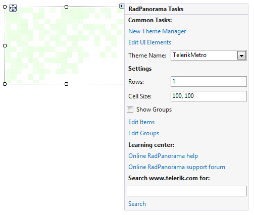
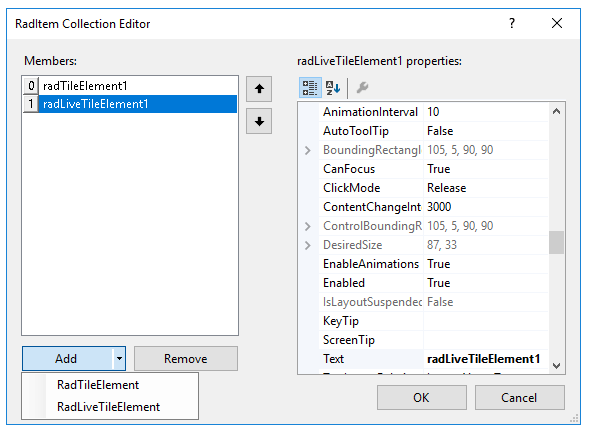
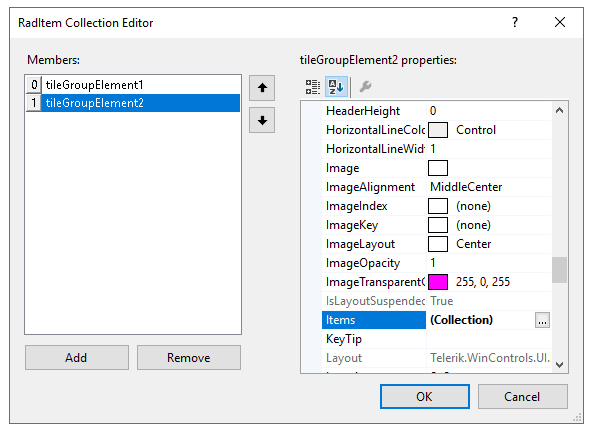
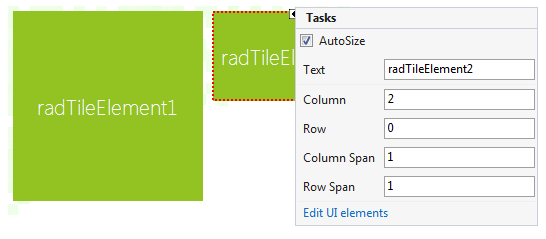
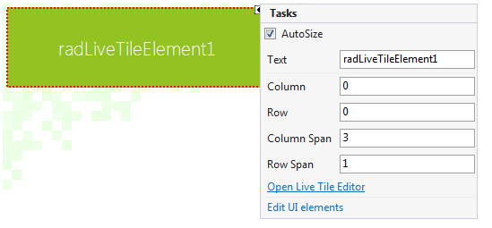
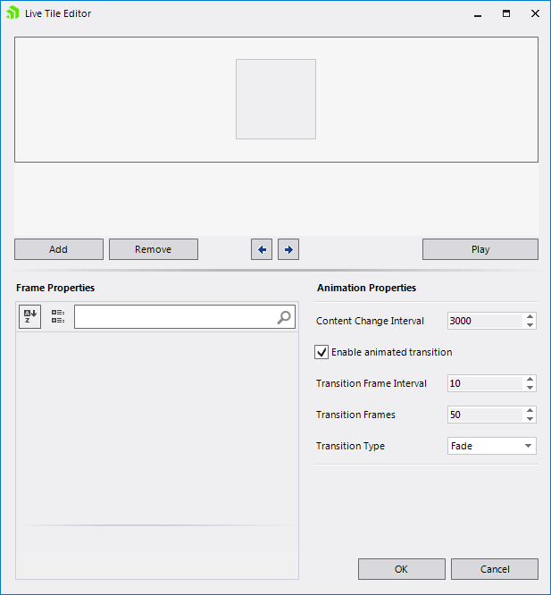

# Design Time

To start using **RadPanorama** just drag it from the toolbox and drop it at the form.
 
## Smart Tag

Select **RadPanorama** and click the small arrow on the top right position in order to open the __Smart Tag__. The __Smart Tag__ for **RadPanorama** lets you quickly access common tasks involved with building **RadPanorama** elements and customizing appearance through themes.

>caption Figure 1: Smart Tag

* __New Theme Manager__: adds a new __RadThemeManager__ component to the form.
            
* __Edit UI Elements__: allows setting properties at multiple levels of the class hierarchy.
            
* __Theme Name__ – allows you to set the theme for the control.
 
* __Rows__ – define the number of rows that the control will have.

* __Cell Size__ – define the size of each cell.

* __Show Groups__ – shows the groups in the control (if any).

* __Edit Items__ – opens the *RadItem Collection Editor*, which allows you to add **RadTileElements** and **RadLiveTileElements**. 

* __Edit Groups__ – opens the *RadItem Collection Editor*, which allows you to add groups to the control.
           
* __Learning Center__: Navigate to the Telerik help, code library projects or support forum.

* __Search__: Search the Telerik site for a given string.    
     
## Adding Tiles

In order to add or remove tiles either click on the “*Edit items*” link in the **Smart Tag** or edit the __Items__ collection in the Properties window in Visual Studio. This will open the *RadItem Collection Editor*. You can add two types of elements to the __Items__ collection: __RadTileElement__ and __RadLiveTileElement__.

## Adding Groups

To add or remove groups click on the “*Edit Groups*” link in the **Smart Tag** or edit the __Groups__ collection in the Properties window in Visual Studio. To add tiles to a group, edit the __Items__ collection of the group itself. Switching between grouped or ungrouped view, is achieved by checking or unchecking the **ShowGroups** check box in the **Smart Tag** or setting the __ShowGroups__ property in the Properties window in Visual Studio.

## Customizing tiles

Each __RadTileElement__'s properties can be customized via the Properties window of Visual Studio, or via the **Smart Tag**. The available properties for customization in the **Smart Tag** are:

* **Text** – sets the text of the tile.

* **Column** – defines in which column the item resides in.

* **Row** – defines in which row the item resides in.

* **Column Span** – defines the item's length by specifying how many columns it should take.

* **Row Span** – defines the item's height by specifying how many rows it should take.

* **Edit UI elements** – allows you to edit the element’s properties.

## Customizing Live Tiles

Each __RadLiveTileElement__'s properties can be customized via the Properties window of Visual Studio, or via the **Smart Tag**. The available properties for customization in the **Smart Tag** are:

* **Text** – sets the text of the tile.

* **Column** – defines in which column the item resides in.

* **Row** – defines in which row the item resides in.

* **Column Span** – defines the item length by specifying how many columns it should take.

* **Row Span** – defines the item height by specifying how many rows it should take.

* **Open Live Tile Editor** – opens the [Live Tile Editor](), where you can customize the tile. 

* **Edit UI elements** – allows you to edit the element’s properties.
 
# See Also

* [Element Hierarchy Editor]()
* [Using default themes]()

