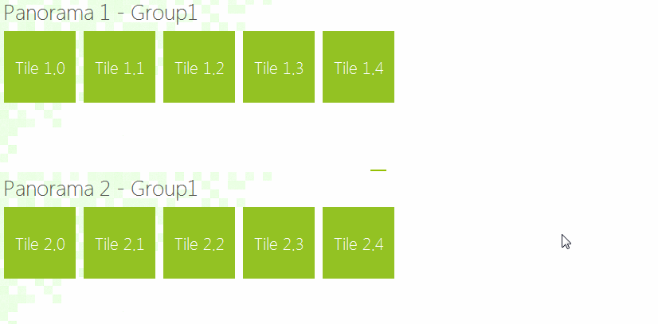

# Drag and Drop

**RadPanorama** handles the whole drag and drop operation by its **TileDragDropService**. The **OnPreviewDragOver** method allows you to control on what targets the tile being dragged can be dropped on. The **OnPreviewDragDrop** method allows you to get a handle on all the aspects of the drag and drop operation, the source (drag) RadPanorama, the destination (target) control, as well as the tile being dragged. This is where the actual physical move of the tile(s) from **RadPanorama** to the target control is performed. 

## Drag and Drop functionality between two RadPanorama controls

By default, **RadPanorama** supports drag and drop functionality of the tiles within the same **RadPanorama**. The following example demonstrates a sample approach how to handle the aforementioned events and achieve drag and drop behavior between two **RadPanorama** controls. There is a **TileGroupElement** added to each **RadPanorama**.

<snippet id='panorama-panoramadragdrop-customtiledragdropservice-cs' />
<snippet id='panorama-panoramadragdrop-customtiledragdropservice-vb' />

In order to replace the default **TileDragDropService** with the default one, it is necessary to set the PanoramaElement.**DragDropService** property:

<snippet id='panorama-panoramadragdrop-replaceservice-cs' />
<snippet id='panorama-panoramadragdrop-replaceservice-vb' />

# See Also

* [Structure]()	
* [Design Time]()	
* [Getting Started]()	
* [Properties and Methods ]()	
* [Tiles]()	
