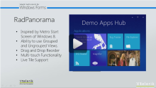
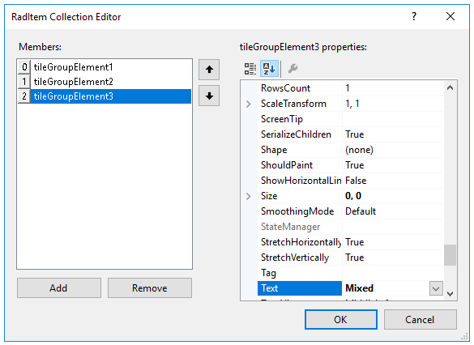
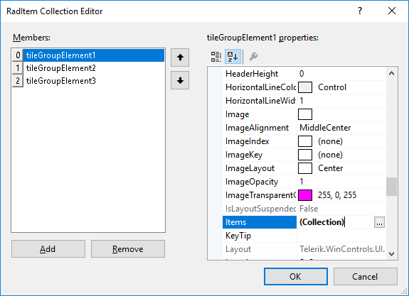
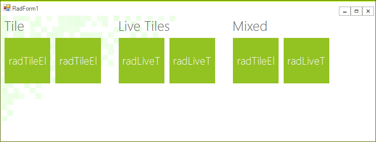
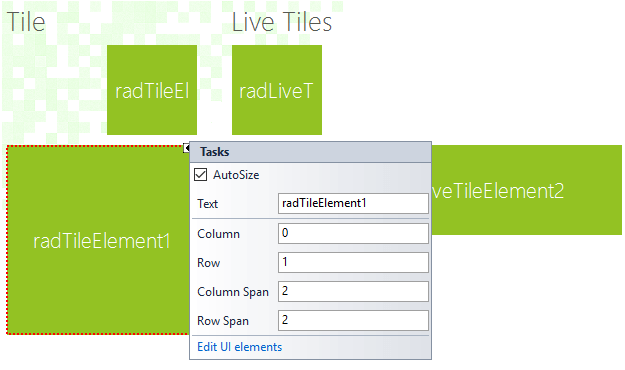
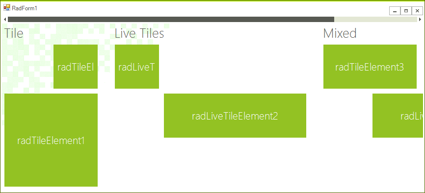

# Getting Started with WinForms Panorama

| RELATED VIDEOS |  |
| --- | ------ |
|[Getting started with RadPanorama ](http://www.telerik.com/videos/winforms/radpanorama-getting-started)|In this video, we are going to see what it takes to get started with the RadPanorama. RadPanorama is a control that displays elements of type RadTileElement in a mosaic manner. This control is inspired by the Metro Start Menu screen of Windows 8.|

This article will demonstrate how to get started with **RadPanorama**. You will be guided through the process of creating a sample application step-by-step.

1\. Let’s start by adding the **RadPanorama** control to the form and setting its __Dock__ property to *Fill* in the Properties window.

2\. Click **RadPanorama** and a small arrow will appear in the upper right corner. Open the **Smart Tag**.

3\. In the **Smart Tag** click the __Edit Groups__ link:

4\. The **RadItem Collection Editor** will be opened. Add three groups and set their __Text__  properties to: *Tile, Live Tiles, Mixed*

5\. Now, navigate to the __Items__ property of each group and add few items in it. In this case the first group will contain only __RadTileElements__, the  second group only __RadListTileElements__ and the third group both types of elements.

6\. Then click `OK` to close the editor.

7\. Go back to the **Smart Tag** and check the __Show Groups__ check box. 

8\. Select each tile and in each tile’s **Smart Tag**, edit its __Column__, __Row__, __Column Span__ and __Row Span__ properties.

9\. Once you are done with the customization of the properties, if the size that the items need is greater than the control size, the scroll bar will automatically be shown: 

10\. The layout is done. You can customize each item according to your needs and also you can subscribe to the __Click__ event of each of them, in order to perform some action upon click. To customize **RadLiveTileElements**, you can use the [Live Tile Editor]().

# See Also

* [Structure]()	
* [Design Time]()		
