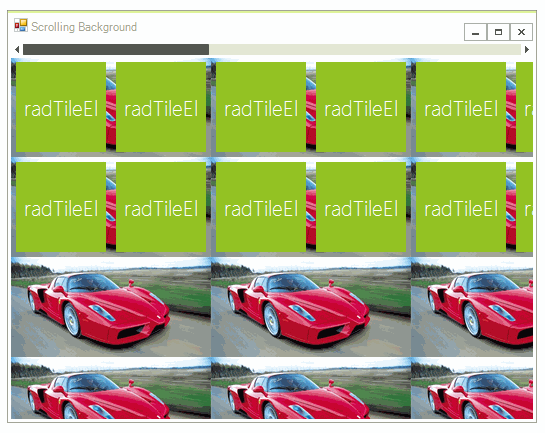

# Scrolling

**RadPanorama** provides scrolling behavior. The scroll bar alignment is controlled by the __ScrollBarAlignment__ property:

#### Set scroll bar alignment

<snippet id='panorama-panoramagettingstarted-scrollbaralignment-cs' />
<snippet id='panorama-panoramagettingstarted-scrollbaralignment-vb' />

The thickness of the scroll bar can be changed by modifying the __ScrollBarThickness__ property of the control:

#### Modify scroll bar thickness

<snippet id='panorama-panoramagettingstarted-scrollthickness-cs' />
<snippet id='panorama-panoramagettingstarted-scrollthickness-vb' />

To change the background image of the view, set the __PanelImage__ property with the desired image. To enable scrolling the background image along with the view, set the __ScrollingBackground__ property to *true*. You will also need to set the __PanelImageSize__ property. Usually, to achieve smooth background scrolling, the width of the panel image should be larger than the client width of the control and smaller than the total width of the tile layout. To edit more properties of the image, you can access its element via the PanoramaElement.__BackgroundImagePrimitive__ property. The following code demonstrates how to setup a tiling background image and a background scrolling:

   

#### Set tiling backgroung image

<snippet id='panorama-panoramagettingstarted-settilingbackground-cs' />
<snippet id='panorama-panoramagettingstarted-settilingbackground-vb' />

# See Also

* [Properties and Methods ]()	
* [Tiles]()	
* [Custom Tiles]()		
