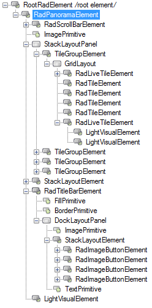
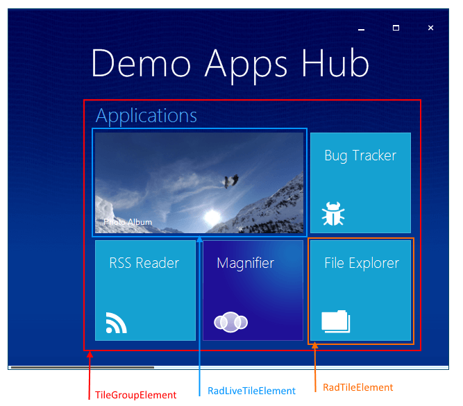

# Structure

This article illustrates the inner structure and organization of the elements which build the **RadPanorama** control.

>caption Figure 1: RadPanorama's elements hierarchy

>caption Figure 2: RadPanorama's visual structure

 
# See Also

* [RadControlSpy]()
* [Design Time]()	
* [Getting Started]()	
