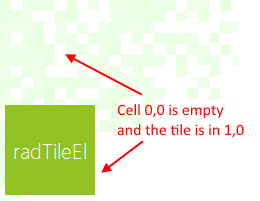
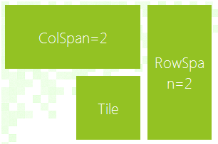
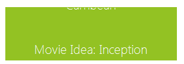
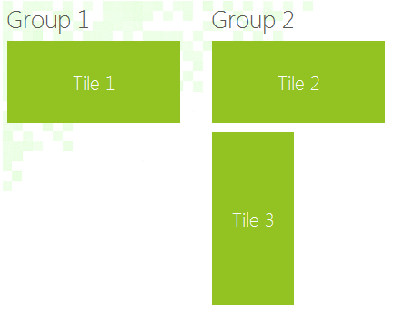

# Tiles

__RadTileElement__ represents a simple tile which can contain text and image and acts like a simple button. You can also add other elements to its __Children__ collection programmatically.

To set the location of a tile, set its __Column__ and __Row__ properties either at design time or via code. These values are zero based and describe the location cell in either the main panel or the group in which the tile is placed. 

#### Set tile's position

<snippet id='panorama-panoramagettingstarted-settileposition-cs' />
<snippet id='panorama-panoramagettingstarted-settileposition-vb' />

>caution **RadPanorama** uses dynamic number of columns, so you can set the __Column__ property of a tile with a value, greater than the __ColumnsCount__ value. However, setting the __Row__ property with a value, greater than the __RowsCount__ value, will result in an exception.
>

To change the span of a tile, set its __RowSpan__ and __ColSpan__ properties. The __RowSpan__ property specifies how many cells of the row should be occupied by the tile. The __ColSpan__ property specifies the number of cells in each column which the tile should occupy.

The __CellPadding__ property specifies the offset of the tile according to the bounds of the cells. The following code snippet demonstrates using the __RowSpan__, __ColSpan__ and __CellPadding__ properties.

<snippet id='panorama-panoramagettingstarted-padding-cs' />
<snippet id='panorama-panoramagettingstarted-padding-vb' />

## Live Tiles

__RadLiveTileElement__ extends the functionality of __RadTileElement__ by providing means of displaying content that changes on a specified time interval.

To change the content element, you can edit the contents of the tiles' __Items__ collection:

#### Add live tiles

<snippet id='panorama-panoramagettingstarted-livetiles-cs' />
<snippet id='panorama-panoramagettingstarted-livetiles-vb' />

The following properties are responsible for controlling the behavior of the transition between content elements:

#### Customize Animation

<snippet id='panorama-panoramagettingstarted-animationproperties-cs' />
<snippet id='panorama-panoramagettingstarted-animationproperties-vb' />

## Populating with Tiles/Groups Programmatically

You can find below a sample code snippet demonstrating how to add groups to **RadPanorama** and fill the groups with tiles.

#### Populating With Data Programmatically

<snippet id='panorama-panoramagettingstarted-populatewithdata-cs' />
<snippet id='panorama-panoramagettingstarted-populatewithdata-vb' />

# See Also

* [Properties and Methods ]()	 
* [Custom Tiles]()	
